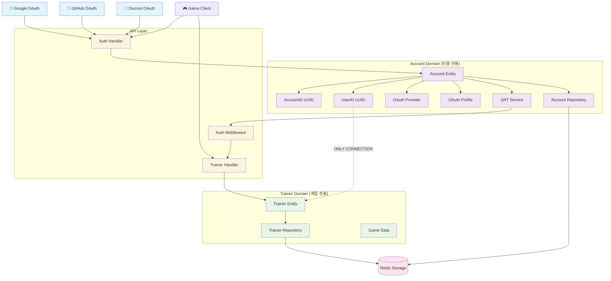
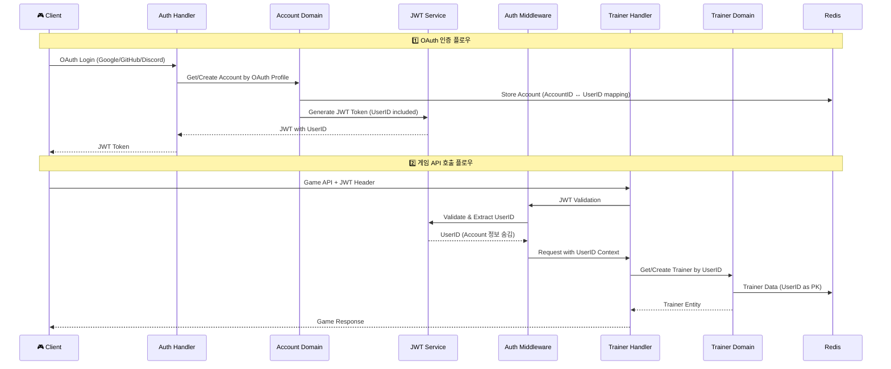

# 🔐 LIFE 게임 OAuth 기반 아키텍처

## 📖 개요

LIFE 게임은 **OAuth 기반 인증**과 **도메인 완전 분리** 아키텍처를 채택하여, 인증 시스템과 게임 로직을 독립적으로 관리합니다.

## 🏗️ 도메인 관계도



## 📋 데이터 흐름도



## 🏛️ 도메인 아키텍처

### Account Domain (인증 전용)

```go
// 핵심 엔티티
type Account struct {
    ID        AccountID     // 내부 식별자
    UserID    UserID       // 게임 도메인 식별자
    Provider  Provider     // google, github, discord
    Profile   OAuthProfile // OAuth에서 가져온 사용자 정보
    CreatedAt Timestamp
    UpdatedAt Timestamp
}

// OAuth 프로필 정보
type OAuthProfile struct {
    ProviderUserID string // OAuth Provider의 사용자 ID
    Email          string // 이메일
    Name           string // 이름
    AvatarURL      string // 프로필 이미지 (선택)
}
```

**책임:**
- ✅ OAuth 인증 처리
- ✅ AccountID ↔ UserID 매핑 관리
- ✅ JWT 토큰 생성/검증
- ✅ 사용자 프로필 정보 관리

### Trainer Domain (게임 전용)

```go
// 핵심 엔티티  
type Trainer struct {
    ID         TrainerID    // == UserID from Account Domain
    Nickname   Nickname
    Level      Level
    Experience Experience
    Stats      Stats
    Position   Position
    Money      Money
    Inventory  Inventory
    Party      AnimalParty
    CreatedAt  Timestamp
    UpdatedAt  Timestamp
}
```

**책임:**
- ✅ 게임 캐릭터 관리
- ✅ 레벨/경험치 시스템
- ✅ 인벤토리/파티 관리
- ✅ 위치/이동 처리
- ❌ 인증/계정 정보 **완전 무관**

## 🔗 핵심 분리 원칙

### 완전한 도메인 분리

| Account Domain | Trainer Domain |
|---------------|----------------|
| ✅ AccountID (내부) | ❌ AccountID 모름 |
| ✅ UserID (게임 식별자) | ✅ UserID (Primary Key) |
| ✅ OAuth 정보 | ❌ OAuth 정보 모름 |
| ✅ JWT 관리 | ❌ 인증 로직 모름 |
| ✅ 사용자 프로필 | ❌ 프로필 정보 모름 |

### 유일한 연결점: UserID

```
AccountID (UUID-1) → UserID (UUID-2) → TrainerID (UUID-2)
     ↑                    ↑                 ↑
  내부 식별자          공통 식별자        게임 식별자
  Account만 알고       양쪽 도메인        Trainer만 알고
     있음               공통으로 사용           있음
```

## 🗃️ 데이터 저장 구조

### Redis Keys 설계

```
# Account Domain
account:{AccountID}                    → Account 전체 데이터
idx:account:provider:{provider:user_id} → AccountID (OAuth 로그인용)
idx:account:user:{UserID}              → AccountID (UserID → Account 역조회용)

# Trainer Domain  
trainer:{UserID}                       → Trainer 전체 데이터
idx:trainer:position:{x}:{y}           → UserID Set (위치별 트레이너)
idx:trainer:nickname:{nickname}        → UserID (닉네임 중복 검사용)
```

### 데이터 예시

```json
// Account 데이터
{
  "id": "acc_123e4567-e89b-12d3-a456-426614174000",
  "user_id": "user_987fcdeb-51a2-43d1-9c4f-123456789abc", 
  "provider": "google",
  "profile": {
    "provider_user_id": "google_12345",
    "email": "player@gmail.com",
    "name": "Player Name",
    "avatar_url": "https://..."
  }
}

// Trainer 데이터 (AccountID 정보 없음!)
{
  "id": "user_987fcdeb-51a2-43d1-9c4f-123456789abc",
  "nickname": "CoolPlayer",
  "level": 15,
  "position": {"x": 10, "y": 20},
  "stats": {"hp": 150, "atk": 25, "def": 15}
}
```

## 🔄 OAuth 인증 플로우

### 1단계: OAuth 로그인 시작

```http
GET /api/auth/oauth/google
→ Response: {"auth_url": "https://accounts.google.com/oauth2/auth?..."}
```

### 2단계: OAuth 콜백 처리

```http
POST /api/auth/oauth/callback
Request: {
  "provider": "google",
  "code": "oauth_authorization_code", 
  "state": "csrf_token"
}
→ Response: {
  "jwt_token": "eyJ...",
  "user_id": "user_987fcdeb...",
  "expires_in": 86400
}
```

### 3단계: 게임 API 호출

```http
POST /api/v1/trainer.Move
Headers: {"Authorization": "Bearer eyJ..."}
Request: {"direction": {"x": 1, "y": 0}}
→ Response: {Trainer Entity with new position}
```

## 🛡️ JWT 토큰 구조

### JWT Claims

```json
{
  "user_id": "user_987fcdeb-51a2-43d1-9c4f-123456789abc", // 게임 식별자
  "email": "player@gmail.com",                              // OAuth 프로필
  "name": "Player Name",                                    // OAuth 프로필  
  "iss": "life-game-server",                               // 발급자
  "sub": "user_987fcdeb-51a2-43d1-9c4f-123456789abc",     // 주체 (UserID)
  "iat": 1234567890,                                        // 발급 시간
  "exp": 1234654290                                         // 만료 시간
}
```

### 특징
- ✅ **UserID만 포함**: AccountID는 완전히 숨김
- ✅ **게임 도메인 친화적**: Trainer Handler에서 바로 사용 가능
- ✅ **OAuth 정보 포함**: 기본 프로필 정보 활용 가능

## 🚀 아키텍처 장점

### 🔒 보안성
- **OAuth Provider가 인증 처리**: 비밀번호 관리 부담 없음
- **도메인 분리**: 게임 로직에서 인증 정보 노출 방지
- **JWT 기반**: Stateless 인증으로 확장성 좋음

### 📈 확장성  
- **다중 OAuth Provider**: Google, GitHub, Discord 등 쉽게 추가
- **독립적 스케일링**: Account/Trainer 도메인별 독립 확장
- **마이크로서비스 준비**: 도메인별 분리로 MSA 전환 용이

### 🔧 유지보수성
- **관심사 분리**: 인증 변경이 게임 로직에 영향 없음
- **테스트 용이**: 각 도메인별 독립 테스트 가능
- **코드 이해**: 도메인별 명확한 책임 구분

### 🎯 개발 효율성
- **병렬 개발**: 인증팀/게임팀 독립 개발 가능
- **재사용성**: Account Domain을 다른 게임에서 재사용 가능
- **단순함**: 각 도메인이 자신의 책임에만 집중

## 📚 구현 파일 구조

```
internal/domain/
├── account/                    # 인증 전용 도메인
│   ├── account.go             # Account 엔티티
│   ├── repository.go          # Repository 인터페이스  
│   ├── redis_repository.go    # Redis 구현
│   └── jwt_service.go         # JWT 토큰 서비스
│
├── trainer/                   # 게임 전용 도메인
│   ├── trainer.go            # Trainer 엔티티 (UserID 기반)
│   ├── repository.go         # Repository 인터페이스
│   └── redis_repository.go   # Redis 구현
│
└── shared/                    # 공통 타입들
    └── types.go              # ID, Position, Stats 등

internal/api/
├── handlers/
│   ├── auth_handler.go       # OAuth 인증 핸들러
│   └── trainer_handler.go    # 게임 핸들러 (UserID 기반)
│
└── middleware/
    └── auth.go               # JWT 미들웨어 (UserID 추출)
```

## 🎯 학습 포인트

### 도메인 주도 설계 (DDD)
- **Bounded Context**: Account와 Trainer는 별개의 컨텍스트
- **Aggregate Root**: 각 도메인의 엔티티가 자신의 데이터 관리
- **Repository Pattern**: 데이터 접근 로직 캡슐화

### 클린 아키텍처
- **의존성 역전**: Repository 인터페이스를 통한 구현 분리
- **관심사 분리**: 인증 vs 게임 로직 완전 분리
- **단일 책임**: 각 컴포넌트가 하나의 책임만 수행

### OAuth 2.0 흐름
- **Authorization Code Flow**: 보안이 강화된 OAuth 흐름
- **State Parameter**: CSRF 공격 방지
- **JWT Token**: Stateless 인증 토큰

이 아키텍처는 **확장성, 보안성, 유지보수성**을 모두 고려한 설계로, 실무에서 사용할 수 있는 수준의 구조를 제공합니다! 🚀