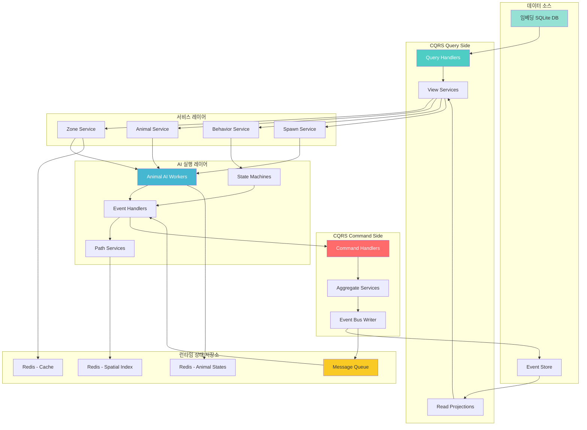
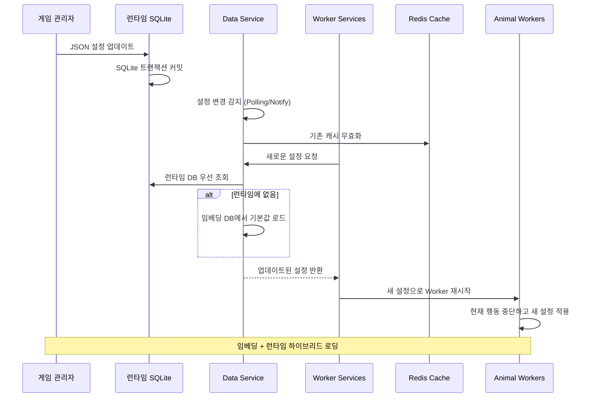
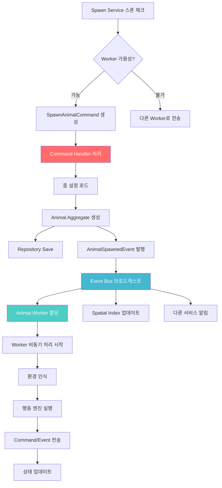

# 동물 AI 시스템 아키텍처 (데이터 기반 설계)

## 개요

LIFE 프로젝트의 **데이터 기반 동물 AI 시스템**으로, 구역별 동물 배치와 행동 패턴을 완전히 설정 데이터로 관리하는 확장 가능한 아키텍처입니다. 게임 밸런스 조정과 새로운 콘텐츠 추가가 코드 수정 없이 데이터 변경만으로 가능합니다.

### 핵심 설계 원칙
- **임베딩 SQLite 전용**: 모든 게임 데이터를 바이너리에 임베딩된 SQLite로 관리
- **JSON Document 저장**: 유연한 설정을 위해 JSON 컬럼 활용
- **구역 기반**: 맵을 구역으로 나누어 각 구역별 생태계 독립 관리
- **읽기 전용 설정**: 단순함을 위해 런타임 설정 변경 없음
- **고성능 인덱싱**: JSON 경로 인덱싱으로 빠른 검색
- **단순한 아키텍처**: 복잡한 동기화 없이 명확한 데이터 흐름

## 시스템 아키텍처



### 시스템 컴포넌트 설명

#### 서비스 레이어
- **Zone Service**: 구역별 환경 관리 및 스폰 규칙 처리
- **Animal Service**: 동물 생명주기 및 상호작용 관리
- **Behavior Service**: 행동 패턴 실행 및 상태머신 전환 처리
- **Spawn Service**: 개체수 모니터링 및 생태계 균형 유지

#### AI 실행 레이어
- **Animal AI Workers**: 개별 동물 AI 로직 병렬 실행
- **State Machines**: 행동 상태 전환 및 시퀀스 관리
- **Event Handlers**: 비동기 이벤트 처리 및 상호작용 중재
- **Path Services**: 이동 경로 계산 및 집단 이동 조율

## SQLite JSON Document 데이터 스키마

### 1. SQLite 테이블 스키마

```sql
-- 구역 설정 테이블 (읽기 전용)
CREATE TABLE zones (
    id TEXT PRIMARY KEY,
    name TEXT NOT NULL,
    config JSON NOT NULL -- 전체 구역 설정 (바이옴, 스폰 규칙 등)
);

-- 동물 종 설정 테이블 (읽기 전용)
CREATE TABLE animal_species (
    species_id TEXT PRIMARY KEY,
    display_name TEXT NOT NULL,
    config JSON NOT NULL -- 동물 전체 설정 (스탯, 행동 패턴 등)
);

-- 행동 패턴 테이블 (읽기 전용)
CREATE TABLE behavior_patterns (
    pattern_id TEXT PRIMARY KEY,
    pattern_name TEXT NOT NULL,
    pattern_type TEXT NOT NULL, -- 'continuous', 'state_machine', 'group_behavior'
    config JSON NOT NULL,
    species_tags JSON -- 어떤 동물 종이 사용할 수 있는지
);

-- 성능을 위한 JSON 경로 인덱스
CREATE INDEX idx_zones_biome ON zones(json_extract(config, '$.biome'));
CREATE INDEX idx_species_category ON animal_species(json_extract(config, '$.category'));
CREATE INDEX idx_species_size ON animal_species(json_extract(config, '$.size_class'));
CREATE INDEX idx_behavior_type ON behavior_patterns(pattern_type);
```

### 2. 구역 데이터 예시

```sql
-- savanna_north 구역 데이터 삽입
INSERT INTO zones (id, name, config) VALUES (
    'savanna_north', 
    '북부 사바나',
    json('{"bounds": {"min_x": 0, "min_y": 0, "max_x": 100, "max_y": 100}, "biome": "savanna", "temperature": 35, "humidity": 0.3, "food_availability": 0.8, "water_sources": [{"x": 25, "y": 50, "radius": 5}, {"x": 75, "y": 25, "radius": 3}], "animal_spawns": [{"species": "zebra", "min_count": 5, "max_count": 12, "spawn_points": [{"x": 30, "y": 40, "radius": 10}, {"x": 60, "y": 70, "radius": 8}], "spawn_conditions": {"time_of_day": ["dawn", "dusk"], "weather": ["clear", "cloudy"], "population_limit": 20}}, {"species": "lion", "min_count": 2, "max_count": 5, "spawn_points": [{"x": 20, "y": 20, "radius": 15}], "spawn_conditions": {"requires_prey": true, "min_prey_count": 8, "territory_size": 25}}], "environmental_events": [{"type": "drought", "probability": 0.1, "duration": "30min", "effects": {"water_sources": "reduce_50%", "animal_behavior": "seek_water_aggressive"}}]}')
);

-- jungle_east 구역 데이터 삽입
INSERT INTO zones (id, name, config) VALUES (
    'jungle_east',
    '동부 정글',  
    json('{"bounds": {"min_x": 100, "min_y": 0, "max_x": 200, "max_y": 150}, "biome": "jungle", "temperature": 28, "humidity": 0.9, "food_availability": 1.0, "animal_spawns": [{"species": "gorilla", "min_count": 3, "max_count": 8, "spawn_points": [{"x": 150, "y": 75, "radius": 20}], "spawn_conditions": {"canopy_cover": "high", "fruit_season": true}}]}')
);
```

### 2. 동물 종 설정 구조

```yaml
# animals_config.yaml
species:
  zebra:
    display_name: "얼룩말"
    category: "herbivore"
    size_class: "medium"
    
    # 기본 스탯
    stats:
      max_hp: 100
      speed: 12.0
      stamina: 150
      vision_range: 25.0
      hearing_range: 30.0
      fear_threshold: 0.6
      
    # 히트박스
    hitbox:
      radius: 1.5
      height: 1.8
      
    # 생존 요구사항
    survival_needs:
      food:
        type: "grass"
        consumption_rate: 10 # per hour
        search_radius: 15.0
      water:
        consumption_rate: 5
        search_radius: 50.0
      shelter:
        required: false
        
    # 행동 패턴
    behavior_patterns:
      - name: "grazing"
        priority: 100
        duration_range: [300, 900] # 5-15분
        cooldown: 600
        conditions:
          time_of_day: ["morning", "afternoon"]
          hunger_level: ">30%"
          
      - name: "herd_following"
        priority: 80
        conditions:
          nearby_zebras: ">2"
          distance_from_herd: ">10m"
          
      - name: "flee_from_predator"
        priority: 200 # 최고 우선순위
        trigger: "predator_spotted"
        flee_distance: 100.0
        flee_speed_multiplier: 1.5
        
    # 상호작용 설정
    interactions:
      with_species:
        zebra:
          type: "herd"
          attraction_range: 20.0
          comfort_distance: 3.0
        lion:
          type: "predator"
          detection_range: 40.0
          flee_threshold: 0.8
        elephant:
          type: "neutral"
          avoidance_distance: 5.0

  lion:
    display_name: "사자"
    category: "carnivore"
    size_class: "large"
    
    stats:
      max_hp: 200
      speed: 15.0
      stamina: 120
      vision_range: 35.0
      hearing_range: 40.0
      aggression: 0.8
      
    behavior_patterns:
      - name: "hunting"
        priority: 150
        trigger: "prey_spotted"
        conditions:
          hunger_level: ">50%"
          stamina: ">30%"
          prey_distance: "<50m"
        chase_duration: 30
        success_rate: 0.3
        
      - name: "territorial_patrol"
        priority: 70
        duration_range: [600, 1800]
        patrol_radius: 50.0
        
      - name: "resting"
        priority: 60
        duration_range: [1800, 3600]
        conditions:
          time_of_day: ["midday", "night"]
          stamina: "<40%"
          
    interactions:
      with_species:
        zebra:
          type: "prey"
          hunt_success_rate: 0.3
          preferred_target: true
        lion:
          type: "pack"
          cooperation_bonus: 0.2
        elephant:
          type: "avoid"
          avoidance_distance: 20.0
```

### 3. 행동 패턴 데이터 구조

```json
{
  "behavior_templates": {
    "grazing": {
      "type": "continuous",
      "animation": "eat_grass",
      "movement_pattern": "random_walk",
      "movement_speed": 0.5,
      "area_radius": 10.0,
      "effects": {
        "hunger": -1.0,
        "happiness": +0.5
      },
      "interruption_conditions": [
        "predator_nearby",
        "loud_noise",
        "hunger_satisfied"
      ]
    },
    
    "hunting": {
      "type": "state_machine",
      "states": {
        "stalking": {
          "movement": "stealth_approach",
          "speed_multiplier": 0.3,
          "detection_reduction": 0.5,
          "max_duration": 60,
          "next_state_conditions": {
            "close_enough": "pouncing",
            "detected": "chasing",
            "timeout": "patrol"
          }
        },
        "pouncing": {
          "movement": "leap_attack",
          "speed_multiplier": 2.0,
          "success_check": "calculate_hunt_success",
          "next_state_conditions": {
            "success": "feeding",
            "miss": "chasing"
          }
        },
        "chasing": {
          "movement": "direct_pursuit",
          "speed_multiplier": 1.5,
          "stamina_drain": 5.0,
          "max_duration": 30,
          "next_state_conditions": {
            "caught": "feeding",
            "escaped": "patrol",
            "exhausted": "resting"
          }
        }
      }
    },
    
    "flocking": {
      "type": "group_behavior",
      "parameters": {
        "cohesion_radius": 15.0,
        "separation_radius": 3.0,
        "alignment_radius": 10.0,
        "cohesion_weight": 1.0,
        "separation_weight": 2.0,
        "alignment_weight": 1.5,
        "leader_following": true,
        "leader_selection": "random_rotation"
      }
    }
  }
}
```

## CQRS 기반 아키텍처 (임베딩 DB 단일 소스)

### 1. 데이터 스키마 관계도

#### SQLite 스키마 구조
```
[zones] ──────┐
  ├── id (PK)  │
  ├── name     │
  └── config   │  (JSON)
               │
[animal_species] ─┼─ 참조 관계
  ├── species_id   │
  ├── display_name │
  └── config       │  (JSON)
                   │
[behavior_patterns] ┴─ 공통 참조
  ├── pattern_id
  ├── pattern_name  
  ├── pattern_type
  ├── config        (JSON)
  └── species_tags  (JSON Array)

[animals] ──────── 런타임 상태
  ├── id (PK)
  ├── species_id  ──→ [animal_species]
  ├── zone_id     ──→ [zones] 
  ├── position    (JSON)
  ├── state       
  └── updated_at
```

#### 객체 관계 매핑
```
ZoneConfig
├── biome_type: string
├── spawn_rules: SpawnRule[]
├── environment_factors: EnvironmentFactor{}
└── allowed_species: string[]

SpeciesConfig  
├── stats: AnimalStats{}
├── behavior_patterns: BehaviorPattern[]
├── interactions: SpeciesInteraction[]
└── evolution_rules: EvolutionRule[]

BehaviorPattern
├── pattern_type: enum(state_machine|group_behavior|reactive)
├── parameters: PatternParameters{}
├── state_transitions: StateTransition[]
└── triggers: TriggerCondition[]

Animal (런타임 엔티티)
├── species_config ──→ SpeciesConfig
├── current_zone ────→ ZoneConfig  
├── active_behaviors ─→ BehaviorPattern[]
└── state: AnimalState{}
```

### 2. CQRS 컴포넌트 관계

```
Query Side                     Command Side
┌──────────────────┐          ┌──────────────────┐
│ ConfigQueryHandler │ ←──────→ │ AnimalCommandHandler│
│ - GetZoneConfig    │          │ - HandleSpawnAnimal │
│ - GetSpeciesConfig │          │ - HandleBehavior    │
│ - GetBehaviorPattern│         │ - HandleMovement    │
└──────────┬───────┘          └─────────┬────────┘
           │                             │
           ▼                             ▼
    ┌─────────────┐                ┌─────────────┐
    │ SQLite DB   │                │ EventBus    │
    │ (임베딩)    │                │ (Redis)     │
    └─────────────┘                └─────────────┘
           │                             │
           └─────── Redis Cache ─────────┘
```

#### 이벤트 흐름도

```
SpawnAnimalCommand ──→ ConfigQueryHandler ──→ SQLite
     │                        │                  │
     └─→ CommandHandler ←─────┘                  │
             │                                   │  
             ▼                                   │
     AnimalAggregate ←─────────── JSON Config ──┘
             │
             ▼
     AnimalSpawnedEvent ──→ EventBus ──→ Redis
             │                              │
             └──── Other Subscribers ←─────┘
```

### 3. 행동 상태 머신

#### 행동 우선순위 매트릭스

```
행동        | 우선순위 | 인터럽트 가능 | 전제 조건
-----------+----------+-------------+--------------
fleeing    |   300    |    NO       | 위험 감지
hunting    |   200    |    YES      | 사냥 + 배고픔
feeding    |   150    |    YES      | 사냥 성공
grazing    |   100    |    YES      | 배고픔 > 50%
flocking   |    80    |    YES      | 무리 내
patrol     |    70    |    YES      | 대기 상태
resting    |    50    |    NO       | 스태미나 < 20%
idle       |    10    |    YES      | 기본 상태
```
```

### 3. 분산 Animal Workers 및 Event-Driven 시스템

#### Animal Worker 구성 요소

- **workerID**: Worker 식별자
- **assignedZones**: 할당된 구역 목록  
- **dataService**: 데이터 액세스 서비스
- **eventBus**: 이벤트 버스 연결
- **behaviorEngine**: 행동 결정 엔진
- **repository**: 동물 상태 저장소
- **coordinator**: Worker 간 분산 조정
- **heartbeat**: Worker 생존 신호

#### Behavior Engine 처리 과정

1. **현재 행동 패턴 조회**: 동물의 현재 활성 행동 패턴 가져오기
2. **인터럽션 조건 검사**: 현재 행동을 중단할 조건들 확인
3. **새 행동 결정**: AI 결정 트리를 통한 최적 행동 선택
4. **상태 변경 처리**: 행동 전환에 따른 상태 업데이트

## 데이터 흐름 및 이벤트 시스템

### 하이브리드 데이터 로딩 시스템



### 분산 CQRS 동물 생성 플로우



## 분산 환경 성능 최적화

### 1. Worker 로드 밸런싱 및 자동 스케일링

#### WorkerCoordinator 구성 요소

- **activeWorkers**: 활성 Worker 정보 맵
- **loadBalancer**: 로드 밸런싱 알고리즘
- **scalingPolicy**: 자동 스케일링 정책
- **healthChecker**: Worker 상태 모니터링

#### WorkerInfo 구조

- **WorkerID**: Worker 고유 식별자
- **AssignedZones**: 할당된 구역 목록  
- **CurrentLoad**: 현재 부하량 (0.0-1.0)
- **LastHeartbeat**: 마지막 생존 신호 시간
- **AnimalCount**: 처리 중인 동물 수
- **ProcessingRate**: 초당 처리 동물 수

#### 작업 할당 프로세스

1. **Worker 상태 검사**: 정상 작동하는 Worker 목록 확인
2. **구역 로드 계산**: 각 구역별 현재 작업 부하량 산출
3. **최적 Worker 선택**: 로드 밸런서를 통한 최적 Worker 결정
4. **스케일 아웃**: 필요시 새로운 Worker 인스턴스 생성

#### 스케일링 설정

- **Container 배포**: Kubernetes Pod 또는 Docker Container
- **리소스 요구사항**: CPU, 메모리, 네트워크 대역폭
- **초기 구역 할당**: 새 Worker에 할당할 초기 구역 설정
```

### 2. Redis 기반 상태 관리

#### 동물 상태 저장 구조

**위치 정보 (GEO 데이터 타입)**
- Key: `animals`
- 공간 인덱싱을 통한 빠른 위치 기반 검색
- 위도/경도 좌표 저장

**상태 정보 (Hash 데이터 타입)**
- Key Pattern: `animal:{animal_id}`
- Fields:
  - species: 동물 종류
  - zone_id: 현재 구역 ID
  - current_hp: 현재 생명력
  - hunger: 배고픔 수치
  - thirst: 목마름 수치  
  - stamina: 스태미나 수치
  - current_behavior: 현재 행동 패턴
  - last_update: 마지막 업데이트 시간

**구역별 인덱스 (Set 데이터 타입)**
- Key Pattern: `zone:{zone_id}:animals`
- 구역별 동물 목록 빠른 조회

**TTL 설정**
- 자동 만료: 10분
- 메모리 누수 방지
```


## 구현 단계

### Phase 1: 기본 구조 구축 (2주)
- [ ] Zone Manager 및 설정 로딩 시스템
- [ ] Animal Config 파서 및 검증
- [ ] 기본 Animal AI 인스턴스 구조
- [ ] Redis 기반 상태 관리

### Phase 2: 행동 시스템 구현 (2주)  
- [ ] 행동 상태 머신 프레임워크
- [ ] 기본 행동 패턴 (grazing, fleeing, hunting)
- [ ] 환경 인식 시스템
- [ ] 상호작용 로직

### Phase 3: 스폰 및 관리 시스템 (1.5주)
- [ ] 구역별 동물 스폰 로직
- [ ] 개체수 관리 및 밸런싱
- [ ] 환경 이벤트 시스템
- [ ] 성능 최적화 (LOD)

### Phase 4: 고급 기능 및 도구 (1주)
- [ ] 실시간 설정 리로딩
- [ ] AI 행동 로깅 및 분석
- [ ] 관리자 대시보드 API
- [ ] 디버깅 및 모니터링 도구

