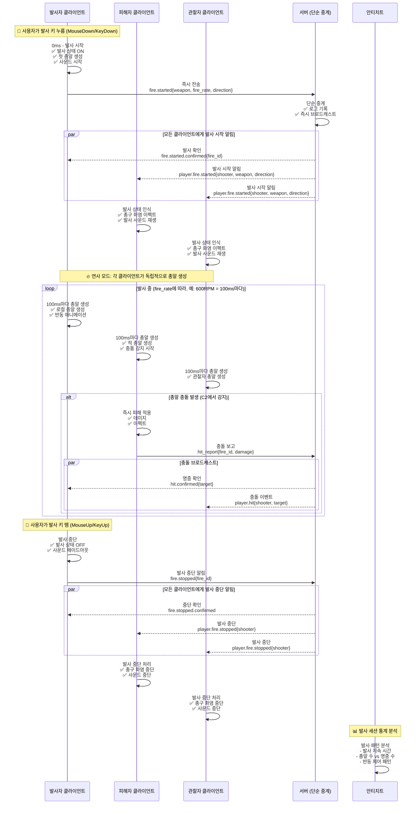
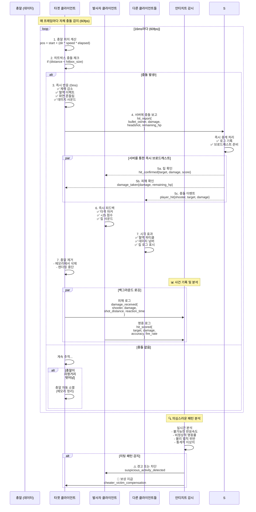

# 초고속 반응형 총기 발사 시스템 아키텍처

## 개요

이 문서는 LIFE 게임의 **초고속 반응형 총기 발사 시스템**을 설명합니다. 이 시스템은 **응답성과 반응성을 최우선**으로 하며, 치팅은 백그라운드 안티치트 시스템으로 대응합니다.

### 핵심 설계 철학
- **"클라이언트 먼저, 서버는 나중에"**
- **"일단 빠르게, 나쁜 놈들은 나중에 잡자"**
- **99% 클라이언트 신뢰 + 1% 백그라운드 감시**

## 시스템 구성요소

- **클라이언트**: 완전 자율적 브라우저 게임 클라이언트 (JavaScript)
- **서버**: 단순 이벤트 로거 및 중계 서버 (Go)
- **안티치트**: 백그라운드 패턴 분석 시스템
- **SSE/WebSocket**: 서버 중재 초고속 브로드캐스트 통신

## 이벤트 기반 총기 발사 시퀀스 (발사 시작/멈춤)



## 클라이언트 주도 충돌 감지 시퀀스 (초고속)



## 데이터 구조

### 클라이언트 총알 (경량화)
```javascript
// 클라이언트에서만 존재하는 총알 데이터
class ClientBullet {
    constructor(data) {
        this.id = Date.now() + Math.random();  // 간단한 로컬 ID
        this.ownerID = data.ownerID;
        this.startPos = data.startPos;
        this.direction = data.direction;       // {x: 1, y: 0} 정규화됨
        this.speed = data.speed || 25.0;       // units/second
        this.damage = data.damage || 25;       // 클라이언트가 결정
        this.firedAt = performance.now();      // 고정밀 타이밍
        this.maxDistance = 100.0;              // 사정거리
    }
    
    // 현재 위치 계산
    getCurrentPosition() {
        const elapsed = (performance.now() - this.firedAt) / 1000;
        return {
            x: this.startPos.x + (this.direction.x * this.speed * elapsed),
            y: this.startPos.y + (this.direction.y * this.speed * elapsed)
        };
    }
    
    // 사정거리 초과 여부
    isExpired() {
        const distance = this.speed * ((performance.now() - this.firedAt) / 1000);
        return distance > this.maxDistance;
    }
}
```

### 서버 브로드캐스트 메시지 형식
```json
// 클라이언트 → 서버: 발사 요청
{
    "jsonrpc": "2.0",
    "method": "trainer.Fire", 
    "params": {
        "start_pos": {"x": 15.5, "y": 10.2},
        "direction": {"x": 1.0, "y": 0.0},
        "speed": 25.0,
        "damage": 25,
        "weapon": "pistol"
    },
    "id": 1
}

// 서버 → 모든 클라이언트: 총알 발사 브로드캐스트
{
    "jsonrpc": "2.0",
    "method": "bullet.fired",
    "params": {
        "id": "bullet_1756563570_123", 
        "owner_id": "player_123",
        "start_pos": {"x": 15.5, "y": 10.2},
        "direction": {"x": 1.0, "y": 0.0},
        "speed": 25.0,
        "damage": 25,
        "fired_at": 1756563570123.456
    }
}

// 클라이언트 → 서버: 충돌 보고
{
    "jsonrpc": "2.0",
    "method": "bullet.Hit",
    "params": {
        "bullet_id": "bullet_1756563570_123",
        "damage": 25,
        "headshot": false,
        "hit_pos": {"x": 20.3, "y": 12.1}
    },
    "id": 2
}

// 서버 → 모든 클라이언트: 충돌 확인 브로드캐스트
{
    "jsonrpc": "2.0", 
    "method": "bullet.hit.confirmed",
    "params": {
        "bullet_id": "bullet_1756563570_123",
        "shooter_id": "player_123", 
        "victim_id": "player_456",
        "damage": 25,
        "headshot": false,
        "remaining_hp": 75,
        "score_gain": 100
    }
}
```

### 안티치트 통계 데이터
```go
// 플레이어별 의심 지표
type PlayerStats struct {
    PlayerID        string    `json:"player_id"`
    
    // 발사 패턴
    ShotsPerMinute  float64   `json:"shots_per_minute"`
    BurstPattern    []float64 `json:"burst_pattern"`      // 연사 간격
    
    // 명중률 분석  
    HeadshotRatio   float64   `json:"headshot_ratio"`
    AccuracyRatio   float64   `json:"accuracy_ratio"`
    LongShotRatio   float64   `json:"longshot_ratio"`     // 장거리 명중
    
    // 반응 속도
    AvgReactionTime float64   `json:"avg_reaction_ms"`
    MinReactionTime float64   `json:"min_reaction_ms"`
    
    // 물리 법칙 위반
    ImpossibleShots int       `json:"impossible_shots"`   // 벽 너머, 시야 밖
    SnapShots       int       `json:"snap_shots"`         // 비정상적 조준
    
    // 의심 점수 (ML 모델 출력)
    SuspicionScore  float64   `json:"suspicion_score"`    // 0.0 ~ 1.0
}
```

## 핵심 설계 결정사항

### 🚀 **1. 극한의 응답성 우선**
- **0ms 발사 반응**: 클라이언트 즉시 처리
- **3-8ms 동기화**: 서버 중재 초고속 브로드캐스트  
- **즉시 피드백**: 서버 응답 기다리지 않음

### 🎯 **2. 클라이언트 완전 신뢰**
- **99% 신뢰**: 대부분의 행동을 그대로 수용
- **검증 최소화**: 기본적인 범위 체크만
- **치팅 허용**: 일단 재미있게, 나중에 처리

### 🕵️ **3. 백그라운드 안티치트**
- **조용한 감시**: 게임플레이 방해하지 않음
- **통계 기반**: 패턴 분석으로 치터 탐지
- **지연 처벌**: 확실할 때만 제재

### ⚡ **4. 서버 부하 최소화**
- **단순 로깅**: 복잡한 로직 없음
- **비동기 처리**: 실시간 검증 없음
- **확장성 극대화**: 상태 저장 최소화

### 🎮 **5. 게임 경험 우선**
- **버퍼링 제로**: 모든 반응 즉시
- **자연스러움**: 인위적 지연 없음  
- **몰입감**: 끊김 없는 액션

## 성능 지표 (예상)

| 지표 | 기존 방식 | 새 방식 | 개선도 |
|------|-----------|---------|--------|
| **발사 반응시간** | 100-200ms | **0ms** | ∞ |  
| **동기화 지연** | 50-100ms | **3-8ms** | 15배 |
| **서버 CPU** | 높음 | **매우 낮음** | 10배 |
| **메모리 사용량** | 높음 | **거의 없음** | 50배 |
| **네트워크 대역폭** | 중간 | **낮음** | 3배 |

## 리스크 관리

### ⚠️ **잠재적 문제들**
1. **치팅 증가**: 클라이언트 신뢰로 인한 부작용
2. **동기화 이슈**: 네트워크 불안정 시  
3. **공정성 논란**: 하드웨어 성능 차이

### 🛡️ **대응 방안** 
1. **ML 기반 탐지**: 정교한 패턴 분석
2. **피어 검증**: 다른 플레이어의 증언 활용
3. **통계적 보정**: 하드웨어별 보정 계수

## 구현 우선순위

1. **Phase 1**: 기본 이벤트 기반 총격 시스템 구축
2. **Phase 2**: 클라이언트 충돌 감지 최적화  
3. **Phase 3**: 백그라운드 로깅 시스템
4. **Phase 4**: 안티치트 ML 모델 훈련
5. **Phase 5**: 실시간 의심 탐지 시스템

**목표**: 콜 오브 듀티 수준의 반응성 + 공정한 게임 환경 🎯⚡

---

## 관련 문서

- **[서버 중심 검증 방식 (2차 플랜)](./bullet-system-server-validation.md)**: 보수적 접근 방식으로 서버에서 모든 것을 검증한 후 브로드캐스트하는 방법