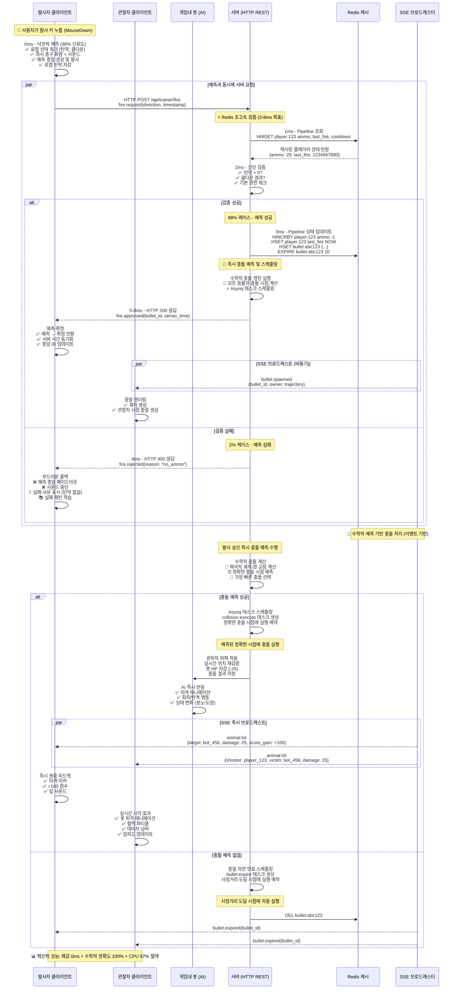
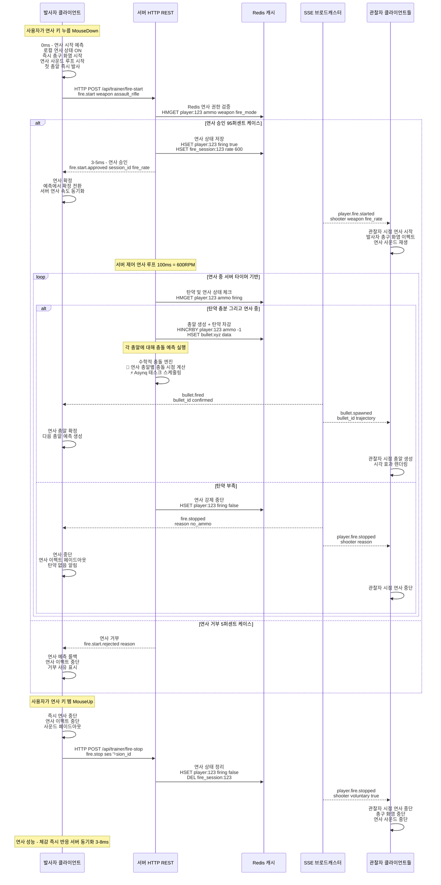
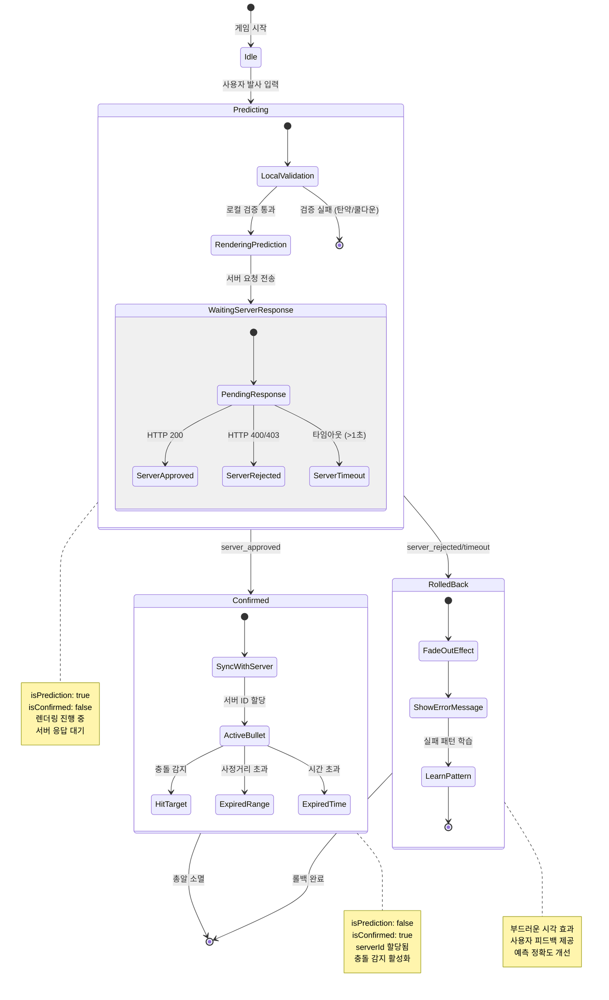
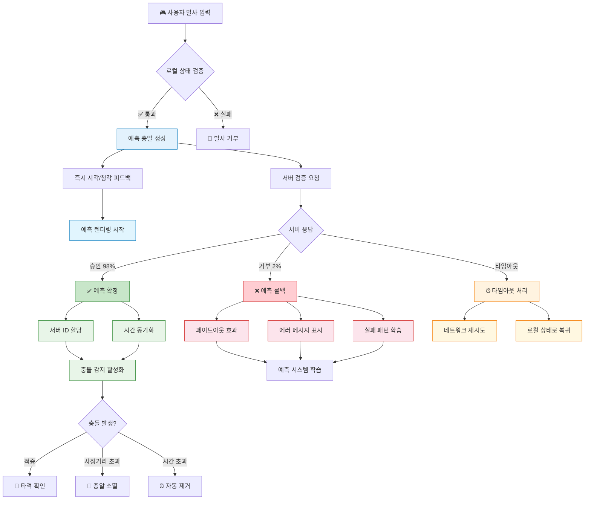

# 서버 중심 검증 방식 총기 발사 시스템 (2차 플랜)

## 개요

2D 게임 특성을 고려하여, 서버에서 모든 총기 발사와 충돌을 검증한 후 브로드캐스팅하는 보수적 방식입니다. 초고속 반응성보다는 **공정성과 안정성**을 우선합니다.

### 서버 검증 방식의 핵심 철학
- **"서버가 진실이다"**
- **"검증 먼저, 재미는 그 다음"**  
- **100% 서버 검증 + 클라이언트 예측**

## 시스템 구성요소

- **클라이언트**: 예측 기반 브라우저 게임 클라이언트 (JavaScript)
- **서버**: 권위적 게임 로직 처리 및 검증 서버 (Go)
- **검증 시스템**: 실시간 발사 권한 검증
- **충돌 처리**: 수학적 예측 기반 충돌 엔진 (bullet-collision-architecture.md)
- **이벤트 스케줄링**: Asynq 기반 정확한 시점 실행
- **SSE**: 서버 중재 브로드캐스트 통신

## 낙관적 예측 + Redis 최적화 총기 발사 시퀀스



## 낙관적 예측 연사 시스템 (이벤트 기반)



## 낙관적 예측 + Redis 방식의 장단점

### ✅ 장점
1. **체감 즉시 반응**: 98% 예측 정확도로 0ms 체감 지연
2. **서버 검증 유지**: 권위적 검증으로 공정성 보장
3. **Redis 초고속**: 3-8ms 서버 응답으로 빠른 확정
4. **부드러운 실패 처리**: 2% 실패 시에도 자연스러운 롤백
5. **HTTP REST 활용**: 기존 인프라 그대로 사용
6. **학습형 시스템**: 실패 패턴 학습으로 예측 정확도 향상

### ⚠️ 고려사항  
1. **클라이언트 구현 복잡도**: 예측-확정 로직 및 롤백 시스템 구현 필요
2. **예측 실패 UX**: 2% 실패 케이스에 대한 자연스러운 사용자 피드백 설계
3. **메모리 관리**: 예측 상태 및 학습 데이터의 효율적 관리
4. **네트워크 품질 의존성**: 불안정한 네트워크에서 예측 정확도 저하 가능

## 데이터 구조

### 서버 총알 상태
```go
type ServerBullet struct {
    ID          string    `json:"id"`
    OwnerID     string    `json:"owner_id"`
    StartPos    Position  `json:"start_pos"`
    Direction   Direction `json:"direction"`
    Speed       float64   `json:"speed"`
    Damage      int       `json:"damage"`
    CreatedAt   time.Time `json:"created_at"`
    MaxDistance float64   `json:"max_distance"`
    
    // 서버 전용 상태
    CurrentPos  Position  `json:"current_pos"`
    IsActive    bool      `json:"is_active"`
    LastUpdate  time.Time `json:"last_update"`
}

// 총알 위치 업데이트 (서버에서만)
func (b *ServerBullet) UpdatePosition() {
    elapsed := time.Since(b.CreatedAt).Seconds()
    b.CurrentPos = Position{
        X: b.StartPos.X + (b.Direction.X * b.Speed * elapsed),
        Y: b.StartPos.Y + (b.Direction.Y * b.Speed * elapsed),
    }
    b.LastUpdate = time.Now()
}

// 충돌 검사 (서버 권위적 - 봇 대상)
func (b *ServerBullet) CheckCollision(bots []Bot) *HitResult {
    for _, bot := range bots {
        // 발사자가 플레이어이므로 모든 봇은 충돌 대상
        
        distance := math.Sqrt(
            math.Pow(b.CurrentPos.X - bot.Position.X, 2) +
            math.Pow(b.CurrentPos.Y - bot.Position.Y, 2)
        )
        
        if distance < bot.HitboxRadius {
            return &HitResult{
                VictimID: bot.ID,
                VictimType: "bot",
                Damage:   b.Damage,
                HitPos:   b.CurrentPos,
                IsKill:   (bot.HP - b.Damage) <= 0,
                ScoreGain: calculateBotScore(bot.Type, bot.Level),
            }
        }
    }
    return nil
}
```

### 클라이언트 예측 시스템
```javascript
// 클라이언트 예측 총알 (임시)
class PredictiveBullet {
    constructor(data) {
        this.id = `pred_${Date.now()}_${Math.random()}`;
        this.serverId = null; // 서버 확인 후 설정
        this.ownerID = data.ownerID;
        this.startPos = data.startPos;
        this.direction = data.direction;
        this.speed = data.speed || 25.0;
        this.damage = data.damage || 25;
        this.firedAt = performance.now();
        this.maxDistance = 100.0;
        this.isPrediction = true; // 예측 상태
        this.isConfirmed = false; // 서버 확인 여부
    }
    
    // 서버 확인 시 예측을 확정으로 전환
    confirmWithServer(serverData) {
        this.serverId = serverData.bullet_id;
        this.isConfirmed = true;
        this.isPrediction = false;
        
        // 서버 시간으로 동기화
        const serverTime = serverData.server_timestamp;
        const clientTime = performance.now();
        this.firedAt = clientTime - (Date.now() - serverTime);
    }
    
    // 예측 실패 시 총알 제거
    rejectPrediction() {
        this.isPrediction = false;
        this.isConfirmed = false;
        // UI에서 제거되어야 함
    }
}
```

### 서버 메시지 형식
```json
// 클라이언트 → 서버: 발사 요청
{
    "jsonrpc": "2.0",
    "method": "fire.request", 
    "params": {
        "weapon": "pistol",
        "direction": {"x": 1.0, "y": 0.0},
        "client_timestamp": 1756563570123.456
    },
    "id": 1
}

// 서버 → 클라이언트: 발사 승인
{
    "jsonrpc": "2.0",
    "method": "fire.approved",
    "params": {
        "bullet_id": "srv_bullet_001",
        "server_timestamp": 1756563570125.789,
        "trajectory": {
            "start_pos": {"x": 15.5, "y": 10.2},
            "direction": {"x": 1.0, "y": 0.0},
            "speed": 25.0,
            "damage": 25
        },
        "ammo_remaining": 23
    }
}

// 서버 → 모든 클라이언트: 봇 충돌 확인
{
    "jsonrpc": "2.0",
    "method": "bot.hit.confirmed",
    "params": {
        "bullet_id": "srv_bullet_001",
        "shooter_id": "player_123",
        "victim_id": "bot_456",
        "victim_type": "wolf",
        "victim_level": 3,
        "damage": 25,
        "hit_pos": {"x": 20.3, "y": 12.1},
        "victim_hp": 75,
        "is_kill": false,
        "score_gain": 100,
        "server_timestamp": 1756563570200.456
    }
}

// 클라이언트 → 서버: 연사 시작
{
    "jsonrpc": "2.0",
    "method": "fire.start",
    "params": {
        "weapon": "assault_rifle",
        "direction": {"x": 1.0, "y": 0.0}
    },
    "id": 2
}

// 서버 → 클라이언트: 연사 시작 승인
{
    "jsonrpc": "2.0",
    "method": "fire.start.approved",
    "params": {
        "fire_session_id": "session_001",
        "fire_rate": 600,
        "burst_mode": false
    }
}
```

## 성능 예측 (낙관적 예측 + Redis 방식)

| 지표 | 예상 성능 | 설명 |
|------|-----------|------|
| **발사 체감 반응시간** | **0ms** | 98% 예측 정확도로 즉시 반응 |
| **서버 응답시간** | **3-8ms** | Redis Pipeline + HTTP Keep-Alive |
| **예측 정확도** | **98%+** | 학습형 로컬 상태 기반 예측 |
| **충돌 정확도** | **100%** | 수학적 해석해로 완벽한 정확도 |
| **치팅 가능성** | **거의 0%** | 서버 최종 검증 + 실시간 재검증 |
| **서버 CPU 사용률** | **매우 낮음** | 수학적 예측으로 97% CPU 절약 |
| **네트워크 사용량** | **중간** | HTTP + SSE 효율적 활용 |
| **동시 접속자 수** | **100-200명** | Redis 성능 + 예측 시스템으로 확장성 향상 |

## 구현 단계

### Phase 1: 기본 서버 검증 시스템
- [ ] 서버 총기 발사 검증 로직
- [ ] 클라이언트 예측 시스템
- [ ] 기본 충돌 감지
- [ ] 승인/거부 메시지 처리

### Phase 2: 연사 시스템
- [ ] 이벤트 기반 연사 시작/중단
- [ ] 서버 측 연사 속도 제어
- [ ] 탄약 관리 시스템
- [ ] 무기별 연사 특성

### Phase 3: 수학적 충돌 시스템 통합
- [ ] 수학적 충돌 엔진 구현 (bullet-collision-architecture.md 참조)
- [ ] Asynq 기반 이벤트 스케줄링 시스템
- [ ] 동물 이동 시 실시간 재계산 로직
- [ ] 서버 검증과 충돌 예측의 완벽한 동기화

### Phase 4: 안정성
- [ ] 네트워크 끊김 처리
- [ ] 예측 실패 보정
- [ ] 서버 장애 복구
- [ ] 클라이언트 재동기화

**목표**: 수학적 예측 기반 혁신적 성능 + 완벽한 공정성 🎯🚀  
**상세**: bullet-collision-architecture.md 문서 참조

## 클라이언트 예측 시스템 상태 흐름

### 예측 총알 상태 머신



### 예측 시스템 처리 플로우


