# 서버 중심 검증 방식 총기 발사 시스템 (2차 플랜)

## 개요

2D 게임 특성을 고려하여, 서버에서 모든 총기 발사와 충돌을 검증한 후 브로드캐스팅하는 보수적 방식입니다. 초고속 반응성보다는 **공정성과 안정성**을 우선합니다.

### 서버 검증 방식의 핵심 철학
- **"서버가 진실이다"**
- **"검증 먼저, 재미는 그 다음"**  
- **100% 서버 검증 + 클라이언트 예측**

## 시스템 구성요소

- **클라이언트**: 예측 기반 브라우저 게임 클라이언트 (JavaScript)
- **서버**: 권위적 게임 로직 처리 및 검증 서버 (Go)
- **검증 시스템**: 실시간 발사 권한 및 충돌 검증
- **SSE**: 서버 중재 브로드캐스트 통신

## 낙관적 예측 + Redis 최적화 총기 발사 시퀀스

```mermaid
sequenceDiagram
    participant C1 as 발사자 클라이언트
    participant C2 as 피해자 클라이언트  
    participant C3 as 관찰자 클라이언트
    participant S as 서버 (HTTP REST)
    participant R as Redis 캐시
    participant SSE as SSE 브로드캐스터
    
    Note over C1: 🔫 사용자가 발사 키 누름 (MouseDown)
    
    C1->>C1: 0ms - 낙관적 예측 (98% 신뢰도)<br/>✅ 로컬 상태 체크 (탄약, 쿨다운)<br/>✅ 즉시 총구 화염 + 사운드<br/>✅ 예측 총알 생성 및 발사<br/>✅ 로컬 탄약 차감
    
    par 예측과 동시에 서버 요청
        C1->>S: HTTP POST /api/trainer/fire<br/>fire.request{direction, timestamp}
        
        Note over S: ⚡ Redis 초고속 검증 (3-8ms 목표)
        
        S->>R: 1ms - Pipeline 조회<br/>HMGET player:123 ammo, last_fire, cooldown
        
        R-->>S: 캐시된 플레이어 상태 반환<br/>{ammo: 29, last_fire: 1234567890}
        
        S->>S: 2ms - 간단 검증<br/>✅ 탄약 > 0?<br/>✅ 쿨다운 경과?<br/>✅ 기본 권한 체크
        
        alt 검증 성공
            Note over S: 98% 케이스 - 예측 성공
            S->>R: 3ms - Pipeline 상태 업데이트<br/>HINCRBY player:123 ammo -1<br/>HSET player:123 last_fire NOW<br/>HSET bullet:abc123 {...}<br/>EXPIRE bullet:abc123 10
            
            S-->>C1: 5-8ms - HTTP 200 응답<br/>fire.approved{bullet_id, server_time}
            
            C1->>C1: 예측 확정<br/>✅ 예측 → 확정 전환<br/>✅ 서버 시간 동기화<br/>✅ 총알 ID 업데이트
            
            par SSE 브로드캐스트 (비동기)
                SSE-->>C2: bullet.spawned<br/>{bullet_id, owner, trajectory}
                SSE-->>C3: bullet.spawned<br/>{bullet_id, owner, trajectory}
            end
            
            C2->>C2: 총알 렌더링<br/>✅ 궤적 생성<br/>✅ 충돌 감지 준비
            C3->>C3: 총알 렌더링<br/>✅ 관찰자 시점 총알 생성
            
        else 검증 실패
            Note over S: 2% 케이스 - 예측 실패
            S-->>C1: 8ms - HTTP 400 응답<br/>fire.rejected{reason: "no_ammo"}
            
            C1->>C1: 부드러운 롤백<br/>❌ 예측 총알 페이드아웃<br/>❌ 사운드 중단<br/>💡 실패 사유 표시 (탄약 없음)<br/>📚 실패 패턴 학습
        end
    end
    
    Note over R,SSE: 🎯 서버 권위적 충돌 처리 (60fps 루프)
    
    loop 16ms마다 Redis 배치 충돌 계산
        S->>R: KEYS bullet:* 활성 총알 조회
        R-->>S: 활성 총알 목록 반환
        
        S->>R: Pipeline으로 모든 총알 상태 조회<br/>HMGET bullet:1 pos_x,pos_y<br/>HMGET bullet:2 pos_x,pos_y
        
        S->>S: 배치 충돌 계산<br/>총알 위치 업데이트<br/>플레이어들과 충돌 체크
        
        alt 충돌 발생!
            S->>R: 충돌 결과 즉시 저장<br/>HINCRBY player:456 hp -25<br/>DEL bullet:abc123
            
            par SSE 충돌 브로드캐스트
                SSE-->>C1: hit.confirmed<br/>{target, damage, score_gain}
                SSE-->>C2: damage.received<br/>{damage, remaining_hp}
                SSE-->>C3: player.hit<br/>{shooter, victim, damage}
            end
            
            C1->>C1: 명중 피드백<br/>✅ 타격 마커<br/>✅ +25 점수<br/>✅ 킬 사운드
            
            C2->>C2: 즉시 피해 적용<br/>✅ HP 바 업데이트<br/>✅ 혈액 이펙트<br/>✅ 화면 흔들림<br/>✅ 피격 사운드
            
            C3->>C3: 시각 효과<br/>✅ 혈액 파티클<br/>✅ 데미지 넘버<br/>✅ 킬피드 업데이트
            
        else 사정거리 초과
            S->>R: DEL bullet:abc123
            SSE-->>C1: bullet.expired{bullet_id}
            SSE-->>C2: bullet.expired{bullet_id}
            SSE-->>C3: bullet.expired{bullet_id}
        end
    end
    
    Note over C1,C3: 📊 성능 지표: 체감 0ms, 서버 응답 3-8ms, 98% 예측 정확도
```



## 낙관적 예측 연사 시스템 (이벤트 기반)

```mermaid
sequenceDiagram
    participant C1 as 발사자 클라이언트
    participant S as 서버 HTTP REST
    participant R as Redis 캐시
    participant SSE as SSE 브로드캐스터
    participant Others as 다른 클라이언트들
    
    Note over C1: 사용자가 연사 키 누름 MouseDown
    
    C1->>C1: 0ms - 연사 시작 예측<br/>로컬 연사 상태 ON<br/>즉시 총구 화염 시작<br/>연사 사운드 루프 시작<br/>첫 총알 즉시 발사
    
    C1->>S: HTTP POST /api/trainer/fire-start<br/>fire.start weapon assault_rifle
    
    S->>R: Redis 연사 권한 검증<br/>HMGET player:123 ammo weapon fire_mode
    
    alt 연사 승인 95퍼센트 케이스
        S->>R: 연사 상태 저장<br/>HSET player:123 firing true<br/>HSET fire_session:123 rate 600
        
        S-->>C1: 3-5ms - 연사 승인<br/>fire.start.approved session_id fire_rate
        
        C1->>C1: 연사 확정<br/>예측에서 확정 전환<br/>서버 연사 속도 동기화
        
        SSE-->>Others: player.fire.started<br/>shooter weapon fire_rate
        
        Others->>Others: 연사 시작 인식<br/>적 총구 화염 이펙트<br/>연사 사운드 재생
        
        Note over S: 서버 제어 연사 루프 100ms = 600RPM
        
        loop 연사 중 서버 타이머 기반
            S->>R: 탄약 및 연사 상태 체크<br/>HMGET player:123 ammo firing
            
            alt 탄약 충분 그리고 연사 중
                S->>R: 총알 생성 + 탄약 차감<br/>HINCRBY player:123 ammo -1<br/>HSET bullet:xyz data
                
                SSE-->>C1: bullet.fired<br/>bullet_id confirmed
                SSE-->>Others: bullet.spawned<br/>bullet_id trajectory
                
                C1->>C1: 연사 총알 확정<br/>다음 총알 예측 생성
                Others->>Others: 적 총알 생성<br/>충돌 감지 시작
            else 탄약 부족
                S->>R: 연사 강제 중단<br/>HSET player:123 firing false
                
                SSE-->>C1: fire.stopped<br/>reason no_ammo
                SSE-->>Others: player.fire.stopped<br/>shooter reason
                
                C1->>C1: 연사 중단<br/>연사 이펙트 페이드아웃<br/>탄약 없음 알림
                Others->>Others: 적 연사 중단 인식
            end
        end
    else 연사 거부 5퍼센트 케이스
        S-->>C1: 연사 거부<br/>fire.start.rejected reason
        
        C1->>C1: 연사 예측 롤백<br/>연사 이펙트 중단<br/>거부 사유 표시
    end
    
    Note over C1: 사용자가 연사 키 뗌 MouseUp
    
    C1->>C1: 즉시 연사 중단<br/>연사 이펙트 중단<br/>사운드 페이드아웃
    
    C1->>S: HTTP POST /api/trainer/fire-stop<br/>fire.stop session_id
    
    S->>R: 연사 상태 정리<br/>HSET player:123 firing false<br/>DEL fire_session:123
    
    SSE-->>Others: player.fire.stopped<br/>shooter voluntary true
    
    Others->>Others: 적 연사 중단<br/>총구 화염 중단<br/>연사 사운드 중단
    
    Note over C1: 연사 성능 - 체감 즉시 반응 서버 동기화 3-8ms
```



## 낙관적 예측 + Redis 방식의 장단점

### ✅ 장점
1. **체감 즉시 반응**: 98% 예측 정확도로 0ms 체감 지연
2. **서버 검증 유지**: 권위적 검증으로 공정성 보장
3. **Redis 초고속**: 3-8ms 서버 응답으로 빠른 확정
4. **부드러운 실패 처리**: 2% 실패 시에도 자연스러운 롤백
5. **HTTP REST 활용**: 기존 인프라 그대로 사용
6. **학습형 시스템**: 실패 패턴 학습으로 예측 정확도 향상

### ⚠️ 고려사항  
1. **클라이언트 구현 복잡도**: 예측-확정 로직 및 롤백 시스템 구현 필요
2. **예측 실패 UX**: 2% 실패 케이스에 대한 자연스러운 사용자 피드백 설계
3. **메모리 관리**: 예측 상태 및 학습 데이터의 효율적 관리
4. **네트워크 품질 의존성**: 불안정한 네트워크에서 예측 정확도 저하 가능

## 데이터 구조

### 서버 총알 상태
```go
type ServerBullet struct {
    ID          string    `json:"id"`
    OwnerID     string    `json:"owner_id"`
    StartPos    Position  `json:"start_pos"`
    Direction   Direction `json:"direction"`
    Speed       float64   `json:"speed"`
    Damage      int       `json:"damage"`
    CreatedAt   time.Time `json:"created_at"`
    MaxDistance float64   `json:"max_distance"`
    
    // 서버 전용 상태
    CurrentPos  Position  `json:"current_pos"`
    IsActive    bool      `json:"is_active"`
    LastUpdate  time.Time `json:"last_update"`
}

// 총알 위치 업데이트 (서버에서만)
func (b *ServerBullet) UpdatePosition() {
    elapsed := time.Since(b.CreatedAt).Seconds()
    b.CurrentPos = Position{
        X: b.StartPos.X + (b.Direction.X * b.Speed * elapsed),
        Y: b.StartPos.Y + (b.Direction.Y * b.Speed * elapsed),
    }
    b.LastUpdate = time.Now()
}

// 충돌 검사 (서버 권위적)
func (b *ServerBullet) CheckCollision(players []Player) *HitResult {
    for _, player := range players {
        if player.ID == b.OwnerID {
            continue // 자신은 제외
        }
        
        distance := math.Sqrt(
            math.Pow(b.CurrentPos.X - player.Position.X, 2) +
            math.Pow(b.CurrentPos.Y - player.Position.Y, 2)
        )
        
        if distance < player.HitboxRadius {
            return &HitResult{
                VictimID: player.ID,
                Damage:   b.Damage,
                HitPos:   b.CurrentPos,
                IsKill:   (player.HP - b.Damage) <= 0,
            }
        }
    }
    return nil
}
```

### 클라이언트 예측 시스템
```javascript
// 클라이언트 예측 총알 (임시)
class PredictiveBullet {
    constructor(data) {
        this.id = `pred_${Date.now()}_${Math.random()}`;
        this.serverId = null; // 서버 확인 후 설정
        this.ownerID = data.ownerID;
        this.startPos = data.startPos;
        this.direction = data.direction;
        this.speed = data.speed || 25.0;
        this.damage = data.damage || 25;
        this.firedAt = performance.now();
        this.maxDistance = 100.0;
        this.isPrediction = true; // 예측 상태
        this.isConfirmed = false; // 서버 확인 여부
    }
    
    // 서버 확인 시 예측을 확정으로 전환
    confirmWithServer(serverData) {
        this.serverId = serverData.bullet_id;
        this.isConfirmed = true;
        this.isPrediction = false;
        
        // 서버 시간으로 동기화
        const serverTime = serverData.server_timestamp;
        const clientTime = performance.now();
        this.firedAt = clientTime - (Date.now() - serverTime);
    }
    
    // 예측 실패 시 총알 제거
    rejectPrediction() {
        this.isPrediction = false;
        this.isConfirmed = false;
        // UI에서 제거되어야 함
    }
}
```

### 서버 메시지 형식
```json
// 클라이언트 → 서버: 발사 요청
{
    "jsonrpc": "2.0",
    "method": "fire.request", 
    "params": {
        "weapon": "pistol",
        "direction": {"x": 1.0, "y": 0.0},
        "client_timestamp": 1756563570123.456
    },
    "id": 1
}

// 서버 → 클라이언트: 발사 승인
{
    "jsonrpc": "2.0",
    "method": "fire.approved",
    "params": {
        "bullet_id": "srv_bullet_001",
        "server_timestamp": 1756563570125.789,
        "trajectory": {
            "start_pos": {"x": 15.5, "y": 10.2},
            "direction": {"x": 1.0, "y": 0.0},
            "speed": 25.0,
            "damage": 25
        },
        "ammo_remaining": 23
    }
}

// 서버 → 모든 클라이언트: 충돌 확인
{
    "jsonrpc": "2.0",
    "method": "hit.confirmed",
    "params": {
        "bullet_id": "srv_bullet_001",
        "shooter_id": "player_123",
        "victim_id": "player_456",
        "damage": 25,
        "hit_pos": {"x": 20.3, "y": 12.1},
        "victim_hp": 75,
        "is_kill": false,
        "server_timestamp": 1756563570200.456
    }
}

// 클라이언트 → 서버: 연사 시작
{
    "jsonrpc": "2.0",
    "method": "fire.start",
    "params": {
        "weapon": "assault_rifle",
        "direction": {"x": 1.0, "y": 0.0}
    },
    "id": 2
}

// 서버 → 클라이언트: 연사 시작 승인
{
    "jsonrpc": "2.0",
    "method": "fire.start.approved",
    "params": {
        "fire_session_id": "session_001",
        "fire_rate": 600,
        "burst_mode": false
    }
}
```

## 성능 예측 (낙관적 예측 + Redis 방식)

| 지표 | 예상 성능 | 설명 |
|------|-----------|------|
| **발사 체감 반응시간** | **0ms** | 98% 예측 정확도로 즉시 반응 |
| **서버 응답시간** | **3-8ms** | Redis Pipeline + HTTP Keep-Alive |
| **예측 정확도** | **98%+** | 학습형 로컬 상태 기반 예측 |
| **충돌 정확도** | **100%** | 서버 권위적 판정 유지 |
| **치팅 가능성** | **거의 0%** | 서버 최종 검증 + 백그라운드 모니터링 |
| **서버 CPU 사용률** | **중간** | Redis 캐시 + 배치 처리로 최적화 |
| **네트워크 사용량** | **중간** | HTTP + SSE 효율적 활용 |
| **동시 접속자 수** | **100-200명** | Redis 성능 + 예측 시스템으로 확장성 향상 |

## 구현 단계

### Phase 1: 기본 서버 검증 시스템
- [ ] 서버 총기 발사 검증 로직
- [ ] 클라이언트 예측 시스템
- [ ] 기본 충돌 감지
- [ ] 승인/거부 메시지 처리

### Phase 2: 연사 시스템
- [ ] 이벤트 기반 연사 시작/중단
- [ ] 서버 측 연사 속도 제어
- [ ] 탄약 관리 시스템
- [ ] 무기별 연사 특성

### Phase 3: 최적화
- [ ] 서버 충돌 감지 최적화
- [ ] 예측 동기화 개선
- [ ] 네트워크 대역폭 최적화
- [ ] 메모리 사용량 최적화

### Phase 4: 안정성
- [ ] 네트워크 끊김 처리
- [ ] 예측 실패 보정
- [ ] 서버 장애 복구
- [ ] 클라이언트 재동기화

**목표**: 2D 게임에 적합한 균형잡힌 반응성 + 완벽한 공정성 🎯⚖️