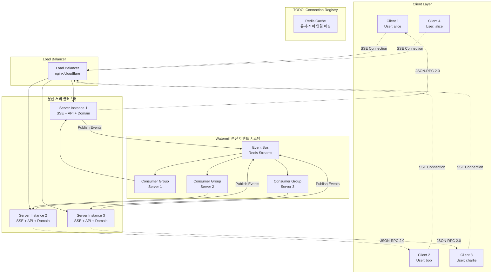
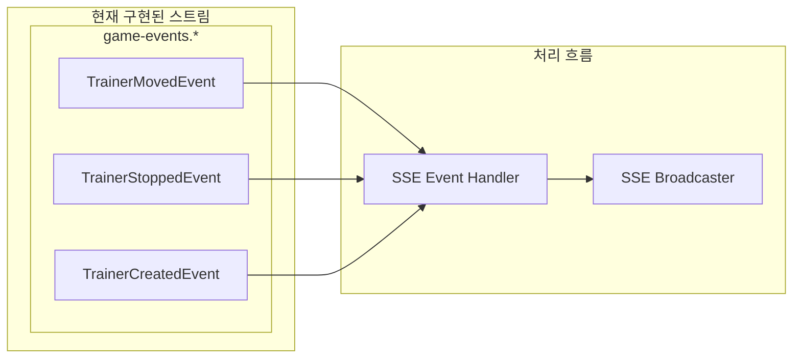
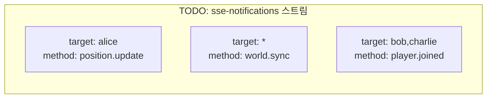
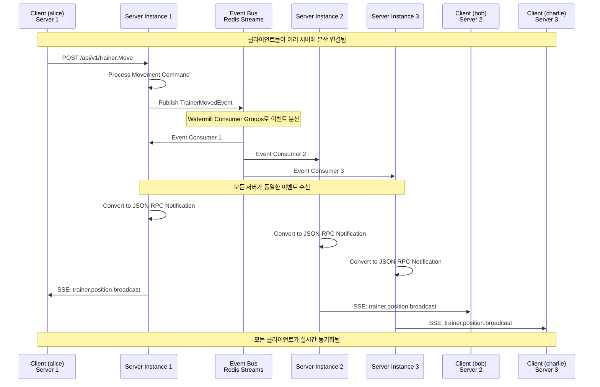
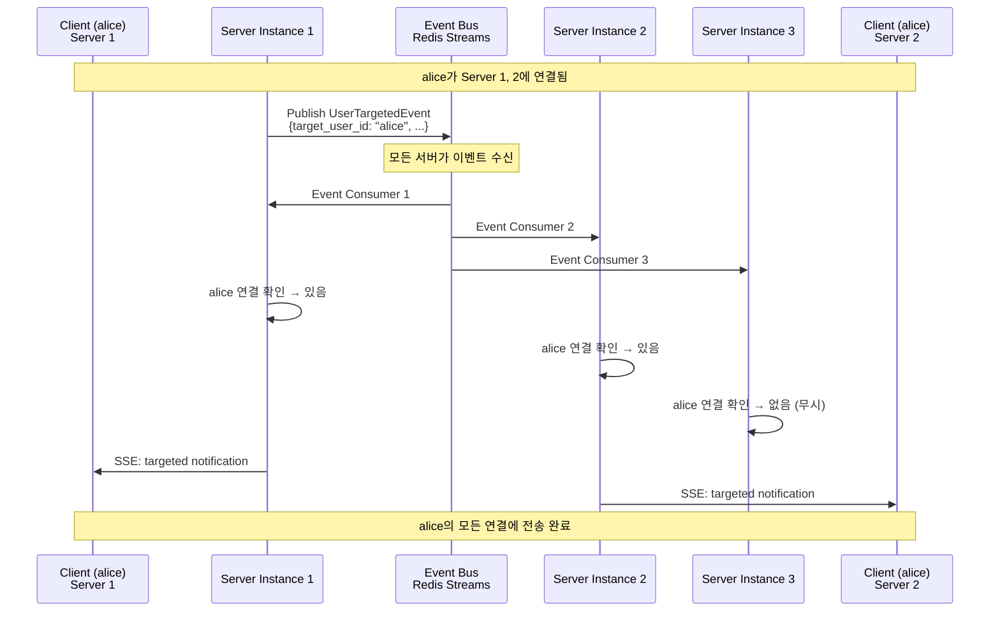
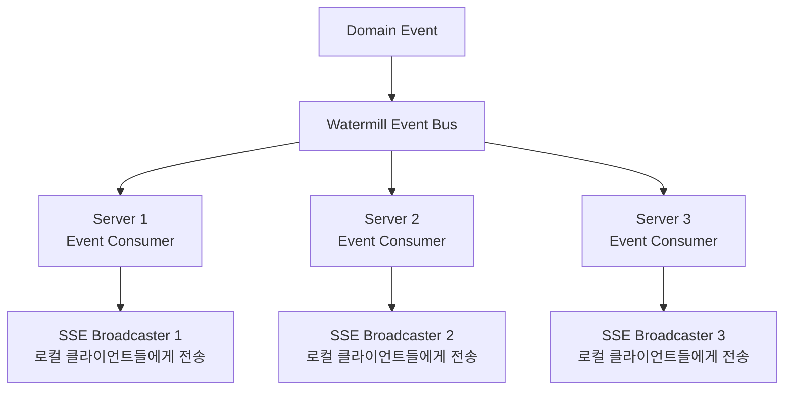
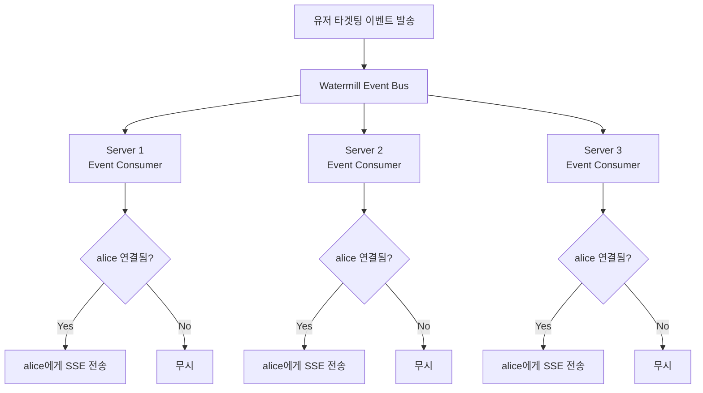
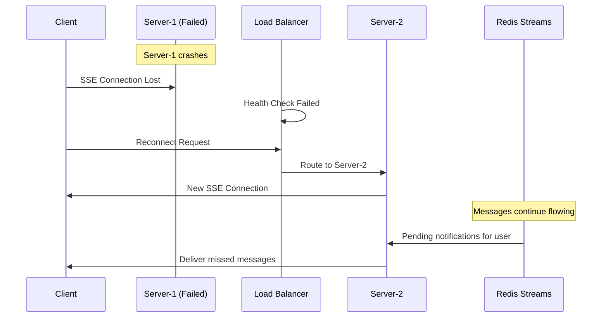

# 분산환경 SSE 브로드캐스팅 아키텍처

## 개요

이 문서는 분산환경에서 Server-Sent Events(SSE)를 통한 실시간 브로드캐스팅 시스템의 아키텍처를 설명합니다. Watermill CQRS 프레임워크와 Redis Streams를 활용하여 여러 서버 인스턴스 간에 JSON-RPC 2.0 notification을 효율적으로 전달합니다.

## 핵심 요구사항

- ✅ **분산 환경 지원**: Watermill을 통한 여러 서버 인스턴스 간 이벤트 분산 처리
- ✅ **브로드캐스트**: 각 서버에서 로컬 연결된 클라이언트들에게 메시지 전송
- 🔄 **특정 유저 타겟팅**: 브로드캐스트 기반 각 서버 자율 판단 방식 (TODO)
- ✅ **JSON-RPC 2.0**: 일관된 메시지 포맷 (jsonrpcx 패키지)
- ✅ **이벤트 기반**: Watermill + Redis Streams를 활용한 분산 CQRS 아키텍처

## 분산 SSE 브로드캐스팅 아키텍처



## 컴포넌트 설계

### 1. 분산 환경 구현 완료 컴포넌트

#### Watermill 분산 이벤트 시스템
- **역할**: 여러 서버 인스턴스 간 이벤트 분산 처리
- **구현**: Redis Streams 기반 Consumer Group으로 각 서버가 동일한 이벤트 수신
- **장점**: 서버 구분 없이 모든 인스턴스가 이벤트를 처리하여 각자의 연결된 클라이언트에게 브로드캐스트

#### SSE Broadcaster (pkg/sse)
- **역할**: 각 서버에서 로컬 클라이언트 연결 관리 및 실시간 메시지 전송
- **위치**: 공유 패키지로 재사용 가능
- **분산 동작**: 
  - 각 서버 인스턴스마다 독립적인 SSE Broadcaster 인스턴스
  - 동일한 이벤트를 수신하여 각자의 로컬 연결 클라이언트들에게 브로드캐스트
  - 서버 구분이 필요 없는 단순하고 효율적인 구조

#### JSON-RPC 알림 시스템 (jsonrpcx)
- **역할**: 표준화된 알림 메시지 형식 제공
- **위치**: 내부 API 패키지
- **형식**: JSON-RPC 2.0 Notification (응답 불필요)

#### CQRS 이벤트 처리기
- **역할**: 도메인 이벤트를 SSE 알림으로 변환
- **분산 처리**: 모든 서버가 동일한 이벤트를 수신하여 각자의 클라이언트들에게 알림 전송
- **처리 이벤트**: TrainerMovedEvent, TrainerStoppedEvent, TrainerCreatedEvent

### 2. TODO: 특정 유저 타겟팅 구현 방안

#### 간단한 브로드캐스트 기반 타겟팅 (권장)

**아이디어**: 발송자는 서버를 구분하지 않고, 타겟 유저 정보가 포함된 이벤트를 브로드캐스트하면, 각 서버에서 해당 유저가 연결되어 있는지 확인하여 전송

**장점**:
- 발송자 측에서 서버 구분 불필요
- Connection Registry 없이도 구현 가능
- 기존 분산 브로드캐스트 구조 그대로 활용
- 각 서버가 자율적으로 판단하여 전송

**구현 방식**:
1. 타겟팅 이벤트에 `target_user_id` 필드 추가
2. 모든 서버가 이벤트 수신
3. 각 서버에서 해당 유저 연결 여부 확인
4. 연결되어 있으면 SSE 전송, 없으면 무시

#### 현재 Watermill Redis Streams 구조



#### TODO: 분산 SSE 전용 스트림



### 3. 분산 환경 메시지 처리 플로우 (현재 구현됨)



### TODO: 브로드캐스트 기반 유저 타겟팅 플로우



### 4. JSON-RPC 2.0 Notification 형식

현재 구현된 알림 메시지 형식:

**위치 업데이트 알림:**
- Method: `trainer.position.updated` (유저 본인용)
- Method: `trainer.position.broadcast` (다른 유저용)

**움직임 중지 알림:**
- Method: `trainer.movement.stopped` (유저 본인용) 
- Method: `trainer.movement.broadcast` (다른 유저용)

**트레이너 생성 알림:**
- Method: `trainer.created` (전체 브로드캐스트)

**시스템 메시지:**
- `connected`: SSE 연결 확인
- `heartbeat`: 연결 유지

## 메시지 처리 패턴

### 1. 분산 브로드캐스트 (현재 구현됨)



**특징:**
- 모든 서버가 동일한 이벤트를 수신
- 각 서버는 자신에게 연결된 클라이언트들에게만 전송
- 서버 구분이 필요 없는 단순하고 효율적인 구조

### 2. TODO: 브로드캐스트 기반 특정 유저 타겟팅



**장점:**
- 발송자는 서버 구분 불필요  
- Connection Registry 없이도 구현 가능
- 기존 분산 브로드캐스트 구조 그대로 활용

## 현재 Watermill 분산 CQRS 설정

### 분산 스트림 구조 (구현 완료)

Watermill이 자동으로 생성하고 관리하는 Redis Streams:
- `game-events.TrainerMovedEvent`
- `game-events.TrainerStoppedEvent` 
- `game-events.TrainerCreatedEvent`

### 분산 Consumer Groups (구현 완료)

각 서버 인스턴스마다 고유한 Consumer Group:
- 패턴: `game-server-{hostname}-{timestamp}`
- **분산 처리**: 모든 서버가 동일한 이벤트를 수신하여 각자의 클라이언트들에게 브로드캐스트
- **장점**: 서버 구분 없이 간단하고 효율적인 분산 브로드캐스팅

### TODO: 특정 유저 타겟팅 이벤트 추가

브로드캐스트 기반 타겟팅을 위한 이벤트:
- `UserTargetedEvent` (특정 유저 타겟팅용, `target_user_id` 필드 포함)
- 기존 Watermill 스트림 구조 그대로 활용 가능

## 구현 예제

### 1. Connection Registry 관리

```go
type ConnectionRegistry struct {
    redis *redis.Client
}

func (cr *ConnectionRegistry) RegisterConnection(userID, serverID, connID string) error {
    key := fmt.Sprintf("connections:%s", userID)
    value := map[string]interface{}{
        "server_id":     serverID,
        "connection_id": connID,
        "last_seen":     time.Now().Unix(),
    }
    return cr.redis.HSet(ctx, key, value).Err()
}

func (cr *ConnectionRegistry) GetUserConnections(userID string) ([]Connection, error) {
    key := fmt.Sprintf("connections:%s", userID)
    return cr.redis.HGetAll(ctx, key).Result()
}
```

### 2. Message Publisher

```go
type MessagePublisher struct {
    redis *redis.Client
}

func (mp *MessagePublisher) PublishToUser(userID string, notification JsonRpcNotification) error {
    data := map[string]interface{}{
        "target": userID,
        "method": notification.Method,
        "params": notification.Params,
    }
    return mp.redis.XAdd(ctx, &redis.XAddArgs{
        Stream: "sse-notifications",
        Values: data,
    }).Err()
}

func (mp *MessagePublisher) Broadcast(notification JsonRpcNotification) error {
    data := map[string]interface{}{
        "target": "*", // broadcast to all
        "method": notification.Method,
        "params": notification.Params,
    }
    return mp.redis.XAdd(ctx, &redis.XAddArgs{
        Stream: "sse-notifications", 
        Values: data,
    }).Err()
}
```

### 3. Message Consumer

```go
func (s *SSEBroadcaster) StartConsumer() {
    go func() {
        for {
            streams, err := s.redis.XReadGroup(ctx, &redis.XReadGroupArgs{
                Group:    fmt.Sprintf("sse-server-%s", s.serverID),
                Consumer: s.serverID,
                Streams:  []string{"sse-notifications", ">"},
                Count:    10,
                Block:    time.Second,
            }).Result()
            
            if err != nil {
                continue
            }
            
            for _, stream := range streams {
                for _, message := range stream.Messages {
                    s.processNotification(message.Values)
                }
            }
        }
    }()
}
```

## 장애 처리 및 복원력

### 1. 서버 장애 시나리오



### 2. Redis 장애 복구

```go
func (s *SSEBroadcaster) handleRedisFailure() {
    // Fallback to local broadcasting only
    s.localMode = true
    
    // Retry connection with exponential backoff
    go s.retryRedisConnection()
    
    // Log degraded mode
    s.logger.Warn("Operating in local-only mode due to Redis failure")
}
```

## 성능 최적화

### 현재 구현된 최적화

#### SSE 연결 관리
- **동시성 제어**: RWMutex를 이용한 안전한 연결 관리
- **메모리 최적화**: 죽드 및 유효하지 않은 연결 자동 정리
- **성능**: 종료된 연결 즉시 제거로 메모리 누수 방지

#### 비동기 메시지 처리
- **전송**: 별도 고루틴에서 비동기 메시지 전송
- **버퍼링**: 전송 채널 버퍼를 통한 메시지 배치 처리
- **사이즈**: 채널 버퍼 크기 100 단위로 성능 최적화

### TODO: 추가 최적화 방안

#### 메시지 배치 처리 (미구현)
- **목표**: 여러 메시지를 배치로 묶어서 전송 효율성 향상
- **전략**: 100ms 내 수집된 메시지들을 한번에 전송
- **효과**: 네트워크 대역폭 사용량 감소

#### 연결 풀링 시스템 (미구현)
- **목표**: 대용량 동시 연결 지원
- **전략**: 연결 수 제한 및 오래된 연결 자동 정리
- **예상 지원 규모**: 서버당 10,000+ 동시 연결

## 모니터링 및 메트릭스

### 현재 지원되는 메트릭스

#### 기본 연결 모니터링
- **Connection Count**: `SSEBroadcaster.GetClientCount()`로 현재 연결 수 확인 가능
- **Connection Lifecycle**: 연결/연결해제 로그 기록
- **Health Check**: `/health` 엔드포인트로 Redis 연결 상태 확인

#### 이벤트 처리 모니터링
- **Event Flow**: Watermill의 기본 로깅으로 이벤트 처리 현황 추적
- **Error Logging**: 이벤트 처리 오류 및 SSE 전송 실패 로깅

### TODO: 고도화된 메트릭스

#### 성능 메트릭스 (미구현)
- **Message Throughput**: 초당 처리되는 메시지 수 측정
- **Redis Stream Lag**: 컨슈머 지연 시간 모니터링
- **Failed Deliveries**: 전달 실패한 메시지 카운트

#### 분산 환경 메트릭스 (미구현)
- **Cross-Server Message Routing**: 서버 간 메시지 라우팅 성능
- **Connection Distribution**: 서버별 연결 분산 현황
- **Load Balancing Metrics**: 로드 밸런서 효율성 측정

## 배포 고려사항

### 현재 배포 구성

#### 서버 식별자
- **현재**: `{hostname}-{timestamp}` 패턴 사용
- **목적**: Watermill Consumer Group 고유성 보장
- **생성 시점**: 서버 시작 시마다 새로운 ID 생성

#### 연결 관리 설정
- **Heartbeat**: 30초 간격 연결 상태 확인
- **Cleanup**: 60초 비활성 연결 자동 제거
- **Buffer Size**: 전송 채널 100 단위 버퍼링

### TODO: 분산 환경 배포

#### 환경 설정 (미구현)
미래 분산 환경을 위한 설정 필요 항목:
- **Redis Streams**: 분산 SSE 전용 스트림 이름
- **Connection Registry**: 연결 정보 저장 키 패턴
- **Cross-Server Routing**: 서버 간 메시지 라우팅 설정
- **Load Balancing**: 로드 밸런서 연동 설정

#### 확장성 고려사항 (미구현)
- **연결 제한**: 서버당 최대 동시 연결 수 설정
- **메시지 저장**: 연결된 유저 미수신 메시지 임시 저장
- **Failover**: 서버 장애 시 자동 메시지 재전송
- **Monitoring**: 분산 환경 전체 모니터링 시스템

## 결론

### 분산 SSE 브로드캐스팅 시스템 구현 완료

✅ **분산 이벤트 처리**: Watermill CQRS를 통한 멀티 서버 환경에서 이벤트 분산 처리
✅ **실시간 분산 브로드캐스트**: 모든 서버가 동일한 이벤트를 수신하여 각자의 클라이언트들에게 전송
✅ **서버 구분 불필요**: 단순하고 효율적인 분산 아키텍처로 복잡성 최소화
✅ **JSON-RPC 2.0 표준**: 일관된 메시지 포맷으로 클라이언트 호환성 보장
✅ **컴포넌트 분리**: SSE 브로드캐스터 공유 패키지화로 재사용성 향상

### 현재 지원하는 분산 기능

- **멀티 서버 브로드캐스트**: 모든 서버 인스턴스의 클라이언트들이 동일한 실시간 업데이트 수신
- **자동 로드 분산**: 클라이언트들이 여러 서버에 분산 연결되어도 모든 이벤트 동기화
- **서버 독립성**: 각 서버가 독립적으로 동작하면서도 분산 이벤트 처리

### TODO: 추가 최적화 기능

🔄 **브로드캐스트 기반 유저 타겟팅**: 서버 구분 없이 각 서버가 자율적으로 판단하여 특정 유저에게 전송
🔄 **성능 모니터링**: 분산 환경 전체 메트릭스 및 모니터링 시스템
🔄 **메시지 배치 처리**: 네트워크 효율성을 위한 메시지 배치 전송

**현재 시스템은 이미 완전한 분산 환경을 지원하며, 여러 서버에서 안정적이고 효율적인 실시간 게임 경험을 제공할 수 있습니다.**