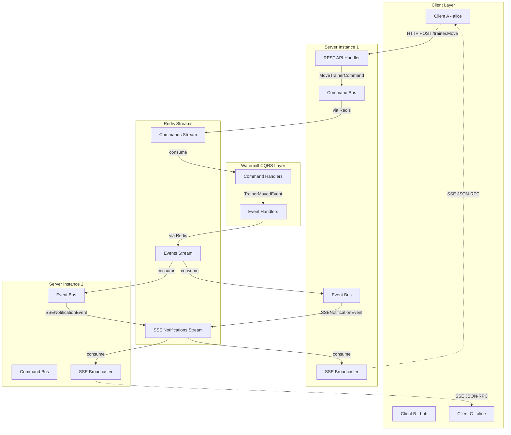

# Watermill CQRS 기반 분산 SSE 브로드캐스팅 구현 워크플로우

## Watermill CQRS 핵심 분석

### 🎯 **주요 개념**
- **CQRS**: Command(쓰기)와 Query(읽기) 책임 분리
- **Event-Driven**: 이벤트 기반 비동기 처리
- **Message Brokers**: Redis Streams, Kafka, AMQP 지원
- **Decoupled Architecture**: 느슨한 결합으로 확장성 향상

### 🔧 **핵심 컴포넌트**
1. **Commands**: 작업 실행 요청 (단일 핸들러)
2. **Events**: 발생한 사실 표현 (여러 핸들러 가능)
3. **Command Bus**: 커맨드를 핸들러로 전달
4. **Event Bus**: 이벤트를 이벤트 핸들러들로 전달
5. **Processors**: 메시지 라우팅 및 핸들러 관리

## 분산 SSE 시스템에 Watermill CQRS 적용

### 전체 아키텍처 플로우



### CQRS 메시지 구조 설계

#### 1. Commands (명령)

```go
// MoveTrainerCommand - 트레이너 이동 명령
type MoveTrainerCommand struct {
    TrainerID   string  `json:"trainer_id"`
    DirectionX  float64 `json:"direction_x"`
    DirectionY  float64 `json:"direction_y"`
    Action      string  `json:"action"` // "start" | "stop"
    Timestamp   time.Time `json:"timestamp"`
}

// BroadcastMessageCommand - 브로드캐스트 명령
type BroadcastMessageCommand struct {
    MessageType string      `json:"message_type"`
    Payload     interface{} `json:"payload"`
    TargetType  string      `json:"target_type"` // "user" | "broadcast" | "group"
    TargetIDs   []string    `json:"target_ids,omitempty"`
    ServerID    string      `json:"server_id"`
}
```

#### 2. Events (이벤트)

```go
// TrainerMovedEvent - 트레이너 이동 완료 이벤트
type TrainerMovedEvent struct {
    TrainerID   string          `json:"trainer_id"`
    Position    shared.Position `json:"position"`
    Movement    trainer.MovementState `json:"movement"`
    Timestamp   time.Time       `json:"timestamp"`
}

// SSENotificationEvent - SSE 알림 이벤트
type SSENotificationEvent struct {
    TargetType  string           `json:"target_type"`
    TargetIDs   []string         `json:"target_ids"`
    Method      string           `json:"method"`
    Params      interface{}      `json:"params"`
    ServerID    string           `json:"server_id,omitempty"`
}

// ConnectionEstablishedEvent - SSE 연결 수립 이벤트
type ConnectionEstablishedEvent struct {
    UserID       string    `json:"user_id"`
    ConnectionID string    `json:"connection_id"`
    ServerID     string    `json:"server_id"`
    Timestamp    time.Time `json:"timestamp"`
}
```

## 구현 워크플로우

### Phase 1: Watermill 의존성 및 기본 구조 설정

#### 1.1 의존성 추가

```bash
go get github.com/ThreeDotsLabs/watermill
go get github.com/ThreeDotsLabs/watermill-redisstream
go get github.com/ThreeDotsLabs/watermill/components/cqrs
```

#### 1.2 기본 CQRS 구조 생성

```go
// internal/cqrs/setup.go
package cqrs

import (
    "github.com/ThreeDotsLabs/watermill"
    "github.com/ThreeDotsLabs/watermill-redisstream/pkg/redisstream"
    "github.com/ThreeDotsLabs/watermill/components/cqrs"
    "github.com/redis/go-redis/v9"
)

type CQRSProcessor struct {
    commandBus *cqrs.CommandBus
    eventBus   *cqrs.EventBus
    processor  *cqrs.Processor
    logger     watermill.LoggerAdapter
}

func NewCQRSProcessor(redisClient *redis.Client, serverID string) (*CQRSProcessor, error) {
    logger := watermill.NewStdLogger(false, false)
    
    // Redis Streams Publisher
    publisher, err := redisstream.NewPublisher(
        redisstream.PublisherConfig{
            Client: redisClient,
        },
        logger,
    )
    if err != nil {
        return nil, err
    }
    
    // Redis Streams Subscriber
    subscriber, err := redisstream.NewSubscriber(
        redisstream.SubscriberConfig{
            Client:        redisClient,
            ConsumerGroup: "game-server-" + serverID,
        },
        logger,
    )
    if err != nil {
        return nil, err
    }
    
    // CQRS Configuration
    cqrsConfig := cqrs.Config{
        GenerateCommandsTopic: func(commandName string) string {
            return "commands." + commandName
        },
        GenerateEventsTopic: func(eventName string) string {
            return "events." + eventName
        },
    }
    
    commandBus, err := cqrs.NewCommandBus(publisher, cqrsConfig)
    if err != nil {
        return nil, err
    }
    
    eventBus, err := cqrs.NewEventBus(publisher, cqrsConfig)
    if err != nil {
        return nil, err
    }
    
    processor, err := cqrs.NewProcessor(subscriber, cqrsConfig)
    if err != nil {
        return nil, err
    }
    
    return &CQRSProcessor{
        commandBus: commandBus,
        eventBus:   eventBus,
        processor:  processor,
        logger:     logger,
    }, nil
}
```

### Phase 2: Command Handlers 구현

#### 2.1 Trainer Movement Command Handler

```go
// internal/cqrs/handlers/trainer_command_handler.go
package handlers

import (
    "context"
    "github.com/ThreeDotsLabs/watermill/components/cqrs"
)

type TrainerCommandHandler struct {
    trainerRepo trainer.Repository
    eventBus    *cqrs.EventBus
    logger      *logger.Logger
}

func NewTrainerCommandHandler(
    repo trainer.Repository,
    eventBus *cqrs.EventBus,
    logger *logger.Logger,
) *TrainerCommandHandler {
    return &TrainerCommandHandler{
        trainerRepo: repo,
        eventBus:    eventBus,
        logger:      logger,
    }
}

func (h *TrainerCommandHandler) HandleMoveTrainer(ctx context.Context, cmd *MoveTrainerCommand) error {
    h.logger.Info("Processing MoveTrainerCommand", 
        zap.String("trainerId", cmd.TrainerID),
        zap.String("action", cmd.Action))
    
    // 1. Get trainer from repository
    trainerUserID := trainer.UserID(cmd.TrainerID)
    var updatedTrainer *trainer.Trainer
    
    err := h.trainerRepo.FindOneAndUpdate(ctx, trainerUserID, func(t *trainer.Trainer) (*trainer.Trainer, error) {
        if t == nil {
            return nil, fmt.Errorf("trainer not found: %s", cmd.TrainerID)
        }
        
        // Update position from current movement
        t.UpdatePositionFromMovement()
        
        // Handle movement action
        if cmd.Action == "start" {
            if err := t.StartMovement(cmd.DirectionX, cmd.DirectionY); err != nil {
                return nil, err
            }
        } else if cmd.Action == "stop" {
            if err := t.StopMovement(); err != nil {
                return nil, err
            }
        }
        
        updatedTrainer = t
        return t, nil
    })
    
    if err != nil {
        return fmt.Errorf("failed to update trainer: %w", err)
    }
    
    // 2. Emit TrainerMovedEvent
    event := &TrainerMovedEvent{
        TrainerID: cmd.TrainerID,
        Position:  updatedTrainer.Position,
        Movement:  updatedTrainer.Movement,
        Timestamp: time.Now(),
    }
    
    return h.eventBus.Publish(ctx, event)
}
```

### Phase 3: Event Handlers 구현

#### 3.1 SSE Notification Event Handler

```go
// internal/cqrs/handlers/sse_event_handler.go
package handlers

import (
    "context"
    "encoding/json"
    "github.com/ThreeDotsLabs/watermill/components/cqrs"
)

type SSEEventHandler struct {
    sseBroadcaster *handlers.SSEBroadcaster
    connectionRegistry *ConnectionRegistry
    eventBus       *cqrs.EventBus
    logger         *logger.Logger
    serverID       string
}

func NewSSEEventHandler(
    broadcaster *handlers.SSEBroadcaster,
    registry *ConnectionRegistry,
    eventBus *cqrs.EventBus,
    logger *logger.Logger,
    serverID string,
) *SSEEventHandler {
    return &SSEEventHandler{
        sseBroadcaster: broadcaster,
        connectionRegistry: registry,
        eventBus: eventBus,
        logger: logger,
        serverID: serverID,
    }
}

// HandleTrainerMoved - 트레이너 이동 이벤트를 SSE로 변환
func (h *SSEEventHandler) HandleTrainerMoved(ctx context.Context, event *TrainerMovedEvent) error {
    h.logger.Info("Processing TrainerMovedEvent for SSE",
        zap.String("trainerId", event.TrainerID))
    
    // Create minimal position update for SSE
    params := MinimalPositionUpdate{
        TrainerID: event.TrainerID,
        X:         event.Position.X,
        Y:         event.Position.Y,
        IsMoving:  event.Movement.IsMoving,
        DirX:      event.Movement.Direction.X,
        DirY:      event.Movement.Direction.Y,
    }
    
    // Emit SSE notification event for ALL servers
    sseEvent := &SSENotificationEvent{
        TargetType: "broadcast", // 모든 연결된 클라이언트에게
        Method:     "position.update",
        Params:     params,
        ServerID:   h.serverID,
    }
    
    return h.eventBus.Publish(ctx, sseEvent)
}

// HandleSSENotification - SSE 알림 이벤트를 실제 클라이언트에게 전송
func (h *SSEEventHandler) HandleSSENotification(ctx context.Context, event *SSENotificationEvent) error {
    // Skip if this event came from our own server (avoid duplicate sending)
    if event.ServerID == h.serverID {
        return nil
    }
    
    h.logger.Info("Processing SSENotificationEvent",
        zap.String("method", event.Method),
        zap.String("targetType", event.TargetType))
    
    // Create JSON-RPC 2.0 notification
    notification := JsonRpcNotification{
        Jsonrpc: "2.0",
        Method:  event.Method,
        Params:  event.Params,
    }
    
    switch event.TargetType {
    case "broadcast":
        return h.sseBroadcaster.BroadcastToAll(notification)
        
    case "user":
        if len(event.TargetIDs) > 0 {
            return h.sseBroadcaster.SendToUser(event.TargetIDs[0], notification)
        }
        
    case "group":
        return h.sseBroadcaster.SendToUsers(event.TargetIDs, notification)
    }
    
    return nil
}

// HandleConnectionEstablished - SSE 연결 수립 이벤트 처리
func (h *SSEEventHandler) HandleConnectionEstablished(ctx context.Context, event *ConnectionEstablishedEvent) error {
    // Update connection registry
    return h.connectionRegistry.RegisterConnection(
        event.UserID,
        event.ServerID,
        event.ConnectionID,
    )
}
```

### Phase 4: SSE Broadcaster 개선

#### 4.1 CQRS 통합 SSE Broadcaster

```go
// internal/api/handlers/sse_broadcaster.go (개선된 버전)
package handlers

import (
    "context"
    "encoding/json"
    "fmt"
    "github.com/ThreeDotsLabs/watermill/components/cqrs"
)

type CQRSSSEBroadcaster struct {
    *SSEBroadcaster // 기존 SSE 기능 상속
    eventBus *cqrs.EventBus
    serverID string
}

func NewCQRSSSEBroadcaster(
    baseBroadcaster *SSEBroadcaster,
    eventBus *cqrs.EventBus,
    serverID string,
) *CQRSSSEBroadcaster {
    return &CQRSSSEBroadcaster{
        SSEBroadcaster: baseBroadcaster,
        eventBus: eventBus,
        serverID: serverID,
    }
}

// BroadcastToAll - 모든 서버의 모든 클라이언트에게 브로드캐스트
func (b *CQRSSSEBroadcaster) BroadcastToAll(notification JsonRpcNotification) error {
    // 1. 로컬 클라이언트들에게 즉시 전송
    if err := b.sendToLocalClients(notification); err != nil {
        b.logger.Error("Failed to send to local clients", zap.Error(err))
    }
    
    // 2. 다른 서버들에게 이벤트 발행
    event := &SSENotificationEvent{
        TargetType: "broadcast",
        Method:     notification.Method,
        Params:     notification.Params,
        ServerID:   b.serverID,
    }
    
    return b.eventBus.Publish(context.Background(), event)
}

// SendToUser - 특정 유저에게 전송 (다른 서버 포함)
func (b *CQRSSSEBroadcaster) SendToUser(userID string, notification JsonRpcNotification) error {
    // 1. 로컬에 연결된 해당 유저에게 전송
    if err := b.sendToLocalUser(userID, notification); err != nil {
        b.logger.Warn("Failed to send to local user", 
            zap.String("userId", userID), zap.Error(err))
    }
    
    // 2. 다른 서버의 해당 유저에게도 전송하도록 이벤트 발행
    event := &SSENotificationEvent{
        TargetType: "user",
        TargetIDs:  []string{userID},
        Method:     notification.Method,
        Params:     notification.Params,
        ServerID:   b.serverID,
    }
    
    return b.eventBus.Publish(context.Background(), event)
}

// OnConnectionEstablished - 새 SSE 연결 수립시 호출
func (b *CQRSSSEBroadcaster) OnConnectionEstablished(userID, connectionID string) error {
    event := &ConnectionEstablishedEvent{
        UserID:       userID,
        ConnectionID: connectionID,
        ServerID:     b.serverID,
        Timestamp:    time.Now(),
    }
    
    return b.eventBus.Publish(context.Background(), event)
}
```

### Phase 5: API Handler 통합

#### 5.1 Trainer Handler를 CQRS로 변경

```go
// internal/api/handlers/trainer_handler.go (개선된 버전)

func (h *TrainerHandler) HandleMove(w http.ResponseWriter, r *http.Request) {
    // ... 기존 인증 및 파싱 로직 ...
    
    // Command 생성 및 전송
    cmd := &MoveTrainerCommand{
        TrainerID:  userID,
        DirectionX: params.DirectionX,
        DirectionY: params.DirectionY,
        Action:     params.Action,
        Timestamp:  time.Now(),
    }
    
    // Command Bus를 통해 비동기 처리
    if err := h.commandBus.Send(r.Context(), cmd); err != nil {
        jsonrpcx.WithError(r, req.ID, jsonrpcx.InternalError, 
            fmt.Sprintf("Failed to process move command: %v", err))
        return
    }
    
    // 즉시 성공 응답 (비동기 처리이므로)
    result := map[string]interface{}{
        "status":    "accepted",
        "timestamp": time.Now(),
    }
    
    jsonrpcx.Success(w, req.ID, result)
}
```

### Phase 6: 서버 시작 및 핸들러 등록

#### 6.1 Main Server Setup

```go
// cmd/server/main.go에 추가

func main() {
    // ... 기존 설정 ...
    
    serverID := fmt.Sprintf("server-%s-%s", 
        os.Getenv("INSTANCE_ID"), 
        uuid.New().String()[:8])
    
    // CQRS Processor 초기화
    cqrsProcessor, err := cqrs.NewCQRSProcessor(redisClient.Client, serverID)
    if err != nil {
        log.Fatal("Failed to initialize CQRS processor", zap.Error(err))
    }
    
    // Command Handlers 등록
    trainerCmdHandler := handlers.NewTrainerCommandHandler(
        trainerRepo, cqrsProcessor.EventBus(), log)
    
    err = cqrsProcessor.RegisterCommandHandler("MoveTrainerCommand", 
        trainerCmdHandler.HandleMoveTrainer)
    if err != nil {
        log.Fatal("Failed to register command handler", zap.Error(err))
    }
    
    // Event Handlers 등록
    sseEventHandler := handlers.NewSSEEventHandler(
        sseBroadcaster, connectionRegistry, cqrsProcessor.EventBus(), log, serverID)
    
    err = cqrsProcessor.RegisterEventHandler("TrainerMovedEvent",
        sseEventHandler.HandleTrainerMoved)
    if err != nil {
        log.Fatal("Failed to register event handler", zap.Error(err))
    }
    
    err = cqrsProcessor.RegisterEventHandler("SSENotificationEvent",
        sseEventHandler.HandleSSENotification)
    if err != nil {
        log.Fatal("Failed to register SSE event handler", zap.Error(err))
    }
    
    // CQRS Processor 시작
    go func() {
        if err := cqrsProcessor.Start(ctx); err != nil {
            log.Error("CQRS processor error", zap.Error(err))
        }
    }()
    
    // ... 나머지 서버 설정 ...
}
```

## 구현 우선순위 및 단계별 테스트

### 1단계: 기본 CQRS 구조 (1-2일)
- [ ] Watermill 의존성 추가
- [ ] 기본 CQRS 프로세서 설정
- [ ] 간단한 Command/Event 구조 테스트

### 2단계: Command Handlers (2-3일)
- [ ] MoveTrainerCommand 핸들러 구현
- [ ] 기존 Trainer Repository 통합
- [ ] Command 처리 테스트

### 3단계: Event Handlers (2-3일)
- [ ] TrainerMovedEvent 핸들러 구현
- [ ] SSE 이벤트 변환 로직
- [ ] 이벤트 플로우 테스트

### 4단계: SSE 통합 (3-4일)
- [ ] CQRS SSE Broadcaster 구현
- [ ] Connection Registry 통합
- [ ] 분산 메시지 전달 테스트

### 5단계: API 통합 및 테스트 (2-3일)
- [ ] TrainerHandler CQRS 통합
- [ ] 전체 플로우 통합 테스트
- [ ] 성능 및 안정성 테스트

## 설정 파일 예제

```yaml
# config/config.yaml
watermill:
  redis:
    streams:
      commands_prefix: "commands"
      events_prefix: "events"
      consumer_group_prefix: "game-server"
    
cqrs:
  command_timeout: 30s
  event_timeout: 10s
  max_retries: 3
  
sse:
  heartbeat_interval: 30s
  connection_timeout: 300s
  max_connections: 10000
```

이 워크플로우를 통해 Watermill CQRS를 활용한 견고하고 확장가능한 분산 SSE 시스템을 구축할 수 있습니다! 🚀